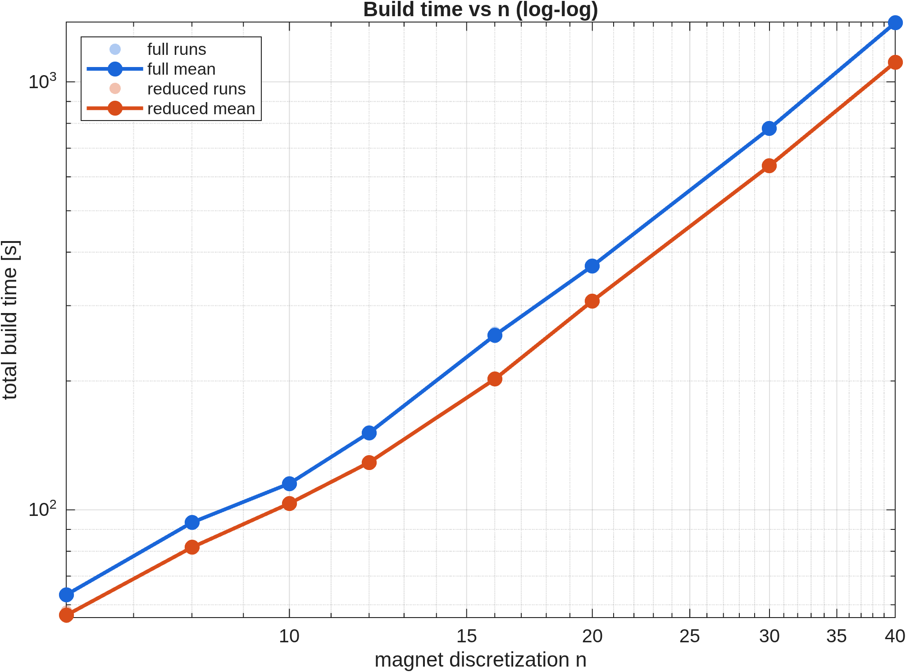
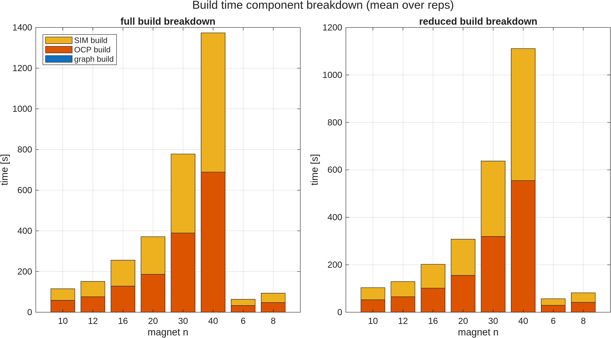
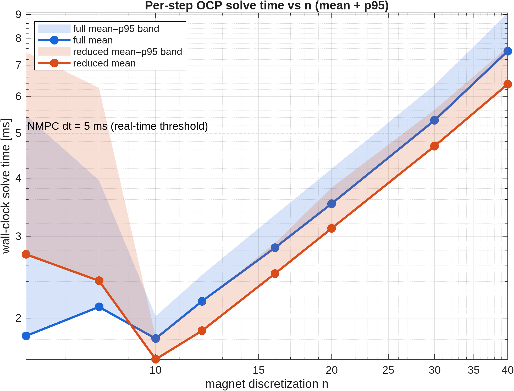
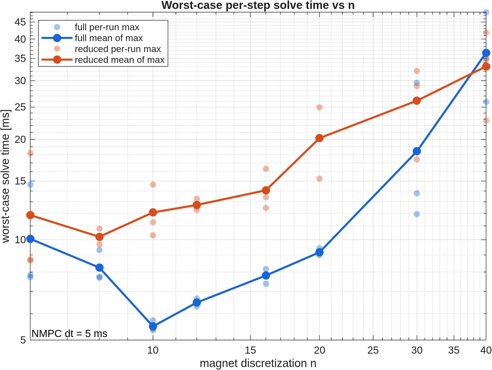
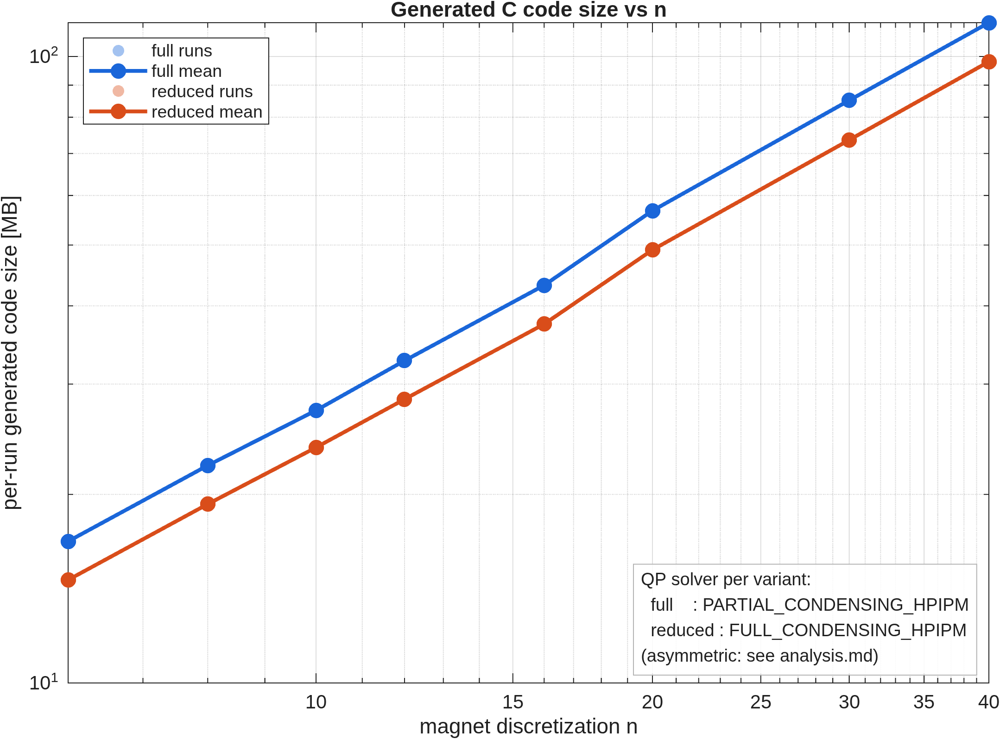
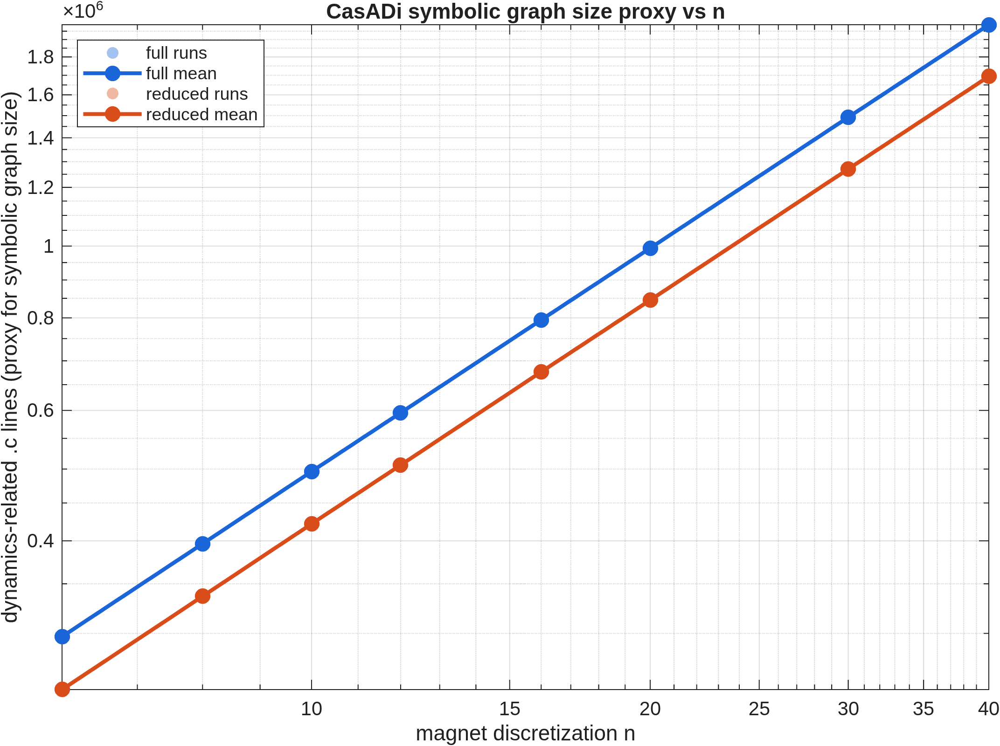
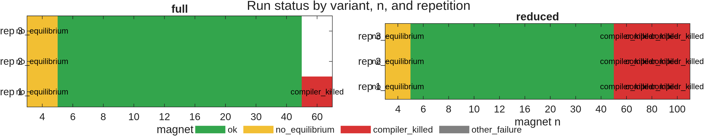

# `n`-Sweep Analysis: NMPC for the 6-DOF Maglev System

**Author:** Marius Jullum Faanes
**Date:** 2026-05-20
**Sources:** `magnet_n_sweep_summary.csv`, `aggregated.csv`,
`per_run_with_code_size.csv`, archived `generated_code/<run_id>/`, sweep logs.

This document accompanies the figures in this directory and is intended as
thesis-presentation material. All plots and tables are produced by
`analyze_sweep.m` — re-run that script to regenerate everything from the raw
CSV.

> **Sweep provenance.** The reduced-variant data was re-run on
> 2026-05-20 (raw `.mat` timestamps 13:20–16:21). The full-variant data is
> carried over unchanged from the prior sweep. Both halves come from the same
> `run_magnet_n_sweep.m` and the same machine; only the reduced rows were
> refreshed.

---

## 1. Experimental setup

The sweep covered the magnet-circumference discretization parameter `n`
(used by the trapezoidal integration over the levitating magnet's surface
current) for two NMPC formulations of the same physical system:

| Variant | States | Dynamics                                             | QP solver                  |
| ------- | ------ | ---------------------------------------------------- | -------------------------- |
| full    | 12     | `[x y z α β γ vx vy vz ωx ωy ωz]`                    | `PARTIAL_CONDENSING_HPIPM` |
| reduced | 10     | `[x y z α β vx vy vz ωx ωy]` (γ and ωz dropped)      | `PARTIAL_CONDENSING_HPIPM` |

Both variants use the same QP solver — `run_magnet_n_sweep.m` lines 285 and
367 both pass `'PARTIAL_CONDENSING_HPIPM'` into `applyCommonOcpOptions`, and
the generated `*_ocp.json` files confirm this. (An earlier CLAUDE.md noted
`FULL_CONDENSING_HPIPM` for the reduced variant; that is out of date with
the current sweep script.) The full/reduced comparison below is therefore a
clean dynamics-only comparison: same QP machinery, same condensing strategy,
only the state vector differs.

Common OCP settings: N = 10 horizon nodes, Tf = 0.05 s (dt = 5 ms), SQP-RTI,
IRK Gauss–Legendre integrator, NONLINEAR_LS cost, control bounds ±1 A on each
of the 4 solenoids, state box bounds on position and tilt.

Sweep grid: `n ∈ {4, 6, 8, 10, 12, 16, 20, 30, 40, 60, 80, 100}` × 3
repetitions × {full, reduced} = 72 attempts in the plan; 64 attempted runs
are present in the CSV (the full variant was not attempted at n = 80 or
n = 100 because the n = 60 run already produced a compile-time OOM kill).

**48 / 64 attempted runs completed successfully** — same headline as the
prior sweep, because the re-run reproduced the same compile-time ceiling on
the reduced variant.

---

## 2. Build time vs n

| n  | full OCP-build [s] | reduced OCP-build [s] | reduced / full |
| -- | ------------------ | --------------------- | -------------- |
|  6 |  32.6              |  28.9                 | 0.89           |
| 10 |  58.4              |  52.2                 | 0.89           |
| 16 | 128.3              | 101.3                 | 0.79           |
| 20 | 186.1              | 155.0                 | 0.83           |
| 30 | 389.4              | 319.0                 | 0.82           |
| 40 | 688.8              | 554.7                 | 0.81           |

**Build time has two roughly equal compile halves**, not one dominant step.
Inspect `build_time_components.png`: at every n the **OCP shared-library
build and the IRK simulator shared-library build take essentially the same
wall time** (e.g. at full n = 40, 688.8 s OCP build vs 684.7 s sim build; at
reduced n = 40, 554.7 vs 556.3 s). Both compile units consume CasADi-generated
implicit-DAE Jacobian C code of similar size, so this symmetry is expected.
CasADi graph construction is essentially flat by comparison (≈ 0.2 s
throughout, independent of n).

On log-log axes the slope is in the range **1.6 – 1.9** depending on which
two n values one regresses between: across n = 6 → 40 the empirical exponent
is ≈ 1.6 (`688.8/32.6 ≈ 21` over a ×6.67 n range); across n = 20 → 40 it has
asymptoted to ≈ 1.9 (`688.8/186.1 ≈ 3.70` over a ×2 n range). Build time is
therefore **super-linear and approaching n² at large n**, considerably worse
than the linear dynamics-graph scaling (Section 5). The extra factor comes
from compiler optimisation passes on the inlined Jacobian code — register
allocation and instruction scheduling are super-linear in basic-block
length, and at large n the OCP and sim C files become very long single
basic blocks.

The reduced model is **consistently ~10 – 20 % faster to build** than the
full model at every successful n (mean ratio 0.85 across the table above),
because dropping γ and ωz removes two columns from the Jacobian and shortens
the auto-generated expressions.

---

## 3. Solve time vs n

| n  | full mean [ms] | reduced mean [ms] | full p95 [ms] | reduced p95 [ms] |
| -- | -------------- | ----------------- | ------------- | ---------------- |
|  6 | 1.83           | 2.74              | 5.46          | 7.46             |
|  8 | 2.11           | 2.41              | 3.96          | 6.26             |
| 10 | 1.81           | 1.63              | 2.02          | 1.82             |
| 16 | 2.83           | 2.49              | 3.33          | 2.90             |
| 20 | 3.53           | 3.12              | 4.19          | 3.82             |
| 30 | 5.33           | 4.69              | 6.34          | 5.61             |
| 40 | 7.50           | 6.37              | 9.07          | 7.65             |

From n ≥ 10 onward the mean per-step OCP solve time grows **approximately
linearly in n** for both variants — each additional discretization point
adds a roughly constant amount of work inside the inlined Jacobian
evaluation that dominates each SQP-RTI step. From n = 10 to n = 40 (×4)
the full-variant mean grows ×4.14 and the reduced-variant mean grows ×3.91 —
essentially linear in n.

A small-n anomaly is worth flagging: at **n = 6 and n = 8 the reduced
variant is actually slower than full** (2.74 vs 1.83 ms at n = 6), and the
p95 columns show a large first-call outlier in both variants. This crosses
back at n ≥ 10. Because both variants use identical QP machinery
(`PARTIAL_CONDENSING_HPIPM`, same condensing horizon), the difference cannot
be attributed to condensing strategy. The most likely explanation is
first-call / warm-up overhead in the OCP solver: at small n the per-step
work is small enough that constant startup costs (initial QP factorisation,
cache warm-up of the freshly-loaded shared library) dominate the
trajectory-mean, and these costs happen to land slightly differently
between variants. The effect washes out once the n-dependent dynamics
evaluation becomes the dominant per-step cost.

The dashed line in `solve_time.png` marks the controller sample time
**dt = 5 ms**. The mean solve time crosses 5 ms at **n ≈ 30 for full**
(5.33 ms) and just **above n = 30 for reduced** (4.69 ms at n = 30, 6.37 ms
at n = 40). The p95 already crosses 5 ms at **n ≈ 20–25 for both variants**.
For a hard real-time deadline at dt = 5 ms, the controller is safe up to
**n ≈ 20**; above that, individual steps will start to miss.

From n ≥ 10 the reduced model is **~10 – 15 % faster than full** at every n.
With identical QP machinery on both sides, this difference is entirely
attributable to the smaller dynamics Jacobian (two fewer states ⇒ two fewer
columns) and the slightly smaller condensed QP downstream.

---

## 4. Generated C code size vs n

> **Important caveat.** The `generated_code_bytes` column in the CSV measures
> the size of the entire archived `c_generated_code/<run_id>/` directory at
> archive time. Because the acados template generator writes into a shared
> working directory that is *not* cleaned between runs, the archived
> directory of a later run contains residue from all earlier runs and the
> raw column overestimates per-run code size by 10–80×. The plot above uses
> a corrected metric `per_run_bytes` (computed by `measure_generated_code.m`)
> that only counts files whose name contains the specific `run_id` —
> i.e. files generated by *that* run.

After this correction:

| n  | full per-run [MB] | reduced per-run [MB] | reduced / full |
| -- | ----------------- | -------------------- | -------------- |
|  6 |  16.8             |  14.6                | 0.87           |
| 10 |  27.2             |  23.8                | 0.87           |
| 16 |  43.1             |  37.4                | 0.87           |
| 20 |  56.7             |  49.1                | 0.87           |
| 30 |  85.1             |  73.6                | 0.86           |
| 40 | 113.2             |  98.1                | 0.87           |

The reduced model is **a remarkably stable ~13 % smaller per run** than the
full model — not 50–75× larger as the raw archive sizes suggest. The
"1.3 GB at n = 6" figure that appears in the raw archive `du -sh` listing is
bookkeeping noise.

Per-run code size scales close to linearly with `n` (×6.74 from n = 6 to
n = 40, while n itself goes ×6.67), in line with the dynamics-only line
count proxy in Section 5.

---

## 5. Symbolic graph size (proxy)

The sweep does not record CasADi introspection metrics (`n_instructions`,
`n_nodes`, …) directly. As a proxy, we count `.c` source lines in
dynamics-related files only (`*_impl_dae_*`, `*_expl_ode_*`, `*_cost*`,
`*_constraints*`, model dir) per run, excluding acados solver / mex /
sfunction glue. These files are direct CasADi codegen output — one line per
emitted SSA instruction — so total line count is a tight, monotone proxy
for the size of the symbolic expression graph.

| n  | full dyn-c lines | reduced dyn-c lines | reduced / full |
| -- | ---------------- | ------------------- | -------------- |
|  6 |   296 969        |   251 918           | 0.85           |
| 10 |   496 171        |   421 662           | 0.85           |
| 20 |   993 643        |   845 264           | 0.85           |
| 30 | 1 492 213        | 1 270 438           | 0.85           |
| 40 | 1 989 583        | 1 694 208           | 0.85           |

Going from n = 6 to n = 40 (×6.67) multiplies the dynamics line count by
**×6.70 (full) and ×6.73 (reduced)** — i.e. the symbolic graph grows
**essentially exactly linearly with n**. That is the expected scaling for a
trapezoidal sum over `n` evaluations of the same per-point integrand: each
evaluation contributes a fixed-size subgraph, and the n terms are summed.

The linear growth of the symbolic graph is the underlying driver of the
linear growth in solve time (Section 3) and code size (Section 4). The
super-linear growth in *build* time (Section 2) is therefore attributable to
the compiler's non-linear cost in processing larger source files, not to
larger symbolic expressions.

---

## 6. Failure modes

The 16 failures fall into exactly two categories, identical to the prior
sweep:

**`no_equilibrium` (6 runs: full n = 4 × 3, reduced n = 4 × 3).**
`computeSystemEquilibria` (called from `runSingleCase` via
`computeSolenoidRadiusCorrectionFactor`) returns no real equilibrium for
n = 4 and the script aborts with `Output argument "c" not assigned`. This is
a *physical* failure: with only 4 sample points around the magnet
circumference the trapezoidal field model is too coarse for an equilibrium
hover state to exist near the design height — there is no `z` at which the
vertical force balances gravity for any solenoid current. It is not a code
bug per se, although `computeSolenoidRadiusCorrectionFactor` should return a
graceful `c = NaN` and let the sweep mark the case unphysical rather than
crash.

**`compiler_killed` (10 runs: full n = 60 × 1, reduced n = 60 × 3,
reduced n = 80 × 3, reduced n = 100 × 3).** Logs show `cc: fatal error:
Killed signal terminated program cc1` while compiling
`*_impl_dae_fun_jac_x_xdot_z.c`. This is the Linux OOM-killer terminating
gcc when its working set exceeds available RAM. The file in question grows
roughly linearly with `n`, but gcc's peak memory during optimisation grows
super-linearly. Because this is a memory-pressure failure, it is somewhat
**stochastic** — it depends on what else is resident at the moment of the
compile — which is consistent with full n = 60 failing in only 1 / 3 reps
while the other 2 / 3 compiled successfully. The current re-run reproduced
the same pattern at the same n values, so the ceiling is stable across days.

There were no convergence / numerical failures of the OCP solver itself in
the successful builds — every successful build produced a closed-loop
trajectory through all simulation steps.

---

## 7. Full vs reduced — summary at n = 40

| Metric (at n = 40)    | full     | reduced  | reduced advantage |
| --------------------- | -------- | -------- | ----------------- |
| OCP build time        | 688.8 s  | 554.7 s  | −19 %             |
| sim build time        | 684.7 s  | 556.3 s  | −19 %             |
| total build time      | 1373.5 s | 1111.0 s | −19 %             |
| solve time (mean)     | 7.50 ms  | 6.37 ms  | −15 %             |
| solve time (p95)      | 9.07 ms  | 7.65 ms  | −16 %             |
| per-run code size     | 113.2 MB |  98.1 MB | −13 %             |
| dynamics graph proxy  | 1.99 M   | 1.69 M   | −15 %             |
| max successful n      | 60 (1/3) | 40       | (similar)         |

The reduced model is a consistent **~13 – 19 % win on every cost metric**
(largest for the compile-time numbers, smallest for code size on disk).
That is smaller than one might hope from removing 2 of 12 states, because
the n-dependent magnetic-field subgraphs (which dominate the symbolic graph)
are shared between the two models — only the parts of the dynamics that
depend on γ and ωz are removed.

The reduced model does **not** materially extend the maximum tractable n:
both variants run into compiler OOM around n = 60. Eliminating two states
buys a constant-factor discount, not a regime change.

---

## 8. Can the code-size explosion be circumvented?

The bottleneck is **gcc memory consumption** when compiling the inlined
CasADi-generated Jacobian for the implicit DAE. Importantly, the failure is
not unique to the OCP shared library — the sim solver compiles a nearly
identically-sized translation unit at the same time, so any mitigation must
target both. In order of expected payoff for this codebase:

1. **Split the dynamics into a precompiled external CasADi shared library.**
   acados supports the `EXTERNAL` cost / dynamics interface where the
   model functions live in their own `.so` produced by CasADi's own
   code-generator (which writes much smaller files because it doesn't
   inline through acados' templating). This converts the giant single
   translation unit into many small ones and is by far the most likely to
   raise the practical n ceiling.

2. **Use `O0` or `O1` compile flags for the model `.c` files specifically.**
   The OOM kill happens during optimisation passes, not during parsing.
   acados exposes compile-flag knobs (see `acados_template/builders.py`).
   Trading some run-time speed for compile feasibility may itself be a
   useful thesis trade-off plot.

3. **Symbolic simplification of the trapezoidal sum.** The dynamics graph
   currently re-instantiates the per-point field integrand `n` times. A
   `casadi.Function` wrapper around the per-point evaluation plus a
   `mapaccum` / `map` would let CasADi share the subgraph and emit a single
   compiled per-point function called n times at run-time, instead of n
   inlined copies. This compresses code size at the cost of one function
   call per integrand evaluation.

4. **Lower the horizon `N` or use 1-stage IRK.** Both directly multiply
   the per-node dynamics cost; halving N halves the file size of the
   monolithic OCP solver. This is a control-side rather than codegen-side
   mitigation.

5. **Experiment with condensing strategy.** Both variants currently use
   `PARTIAL_CONDENSING_HPIPM`. Switching the reduced variant to
   `FULL_CONDENSING_HPIPM` (small dense problem, nx = 10, N = 10) might be
   faster at the QP step, though it would *not* change the dynamics file
   that triggers the OOM (the failure happens in `_impl_dae_*`) and so
   would not raise the n ceiling.

---

## 9. Recommendations for the thesis

* The headline finding is that **build time grows super-linearly (≈ n¹·⁶ – n¹·⁹)
  while solve time and graph size grow linearly**. The compiler is the
  bottleneck, not CasADi.
* Build time is split roughly **50 / 50 between the OCP and sim solver
  compiles** — they consume nearly identical CasADi C output. Any mitigation
  has to target both translation units.
* The reduced 10-state model is a uniform **~13 – 19 % win** on all cost
  metrics but does not change scaling exponents and does not extend the
  maximum feasible n.
* The hard ceiling at n ≈ 60 is a *compile-time* (gcc memory) ceiling, not
  a runtime ceiling. Real-time controller feasibility is lost earlier:
  **mean solve crosses dt = 5 ms at n ≈ 30, p95 already at n ≈ 20 – 25**, so
  the compile ceiling is not the binding constraint for closed-loop
  performance — it does, however, block higher-fidelity offline studies.
* The small-n solve-time anomaly (reduced slower than full at n = 6, 8 and
  large p95 first-call spikes) is worth a footnote in the thesis: with
  identical QP machinery on both variants, it is best read as a startup /
  warm-up effect that washes out once n is large enough for the dynamics
  evaluation to dominate the per-step cost.
* If a follow-up sweep is to be run, two cheap changes would yield
  meaningfully better data:
  1. Add `n_instructions()` / `n_nodes()` / `nnz()` calls on the CasADi
     `Function` objects after they are built and log them in the CSV — this
     replaces the line-count proxy with the real metric.
  2. Clean the `c_generated_code/` working directory between runs so the
     archived `generated_code_bytes` column matches per-run reality
     without post-hoc filtering.
