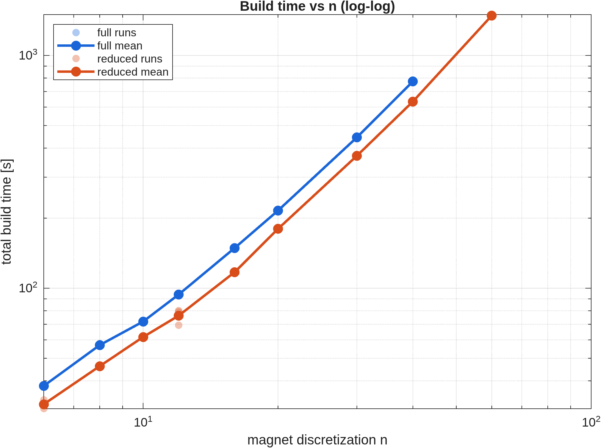
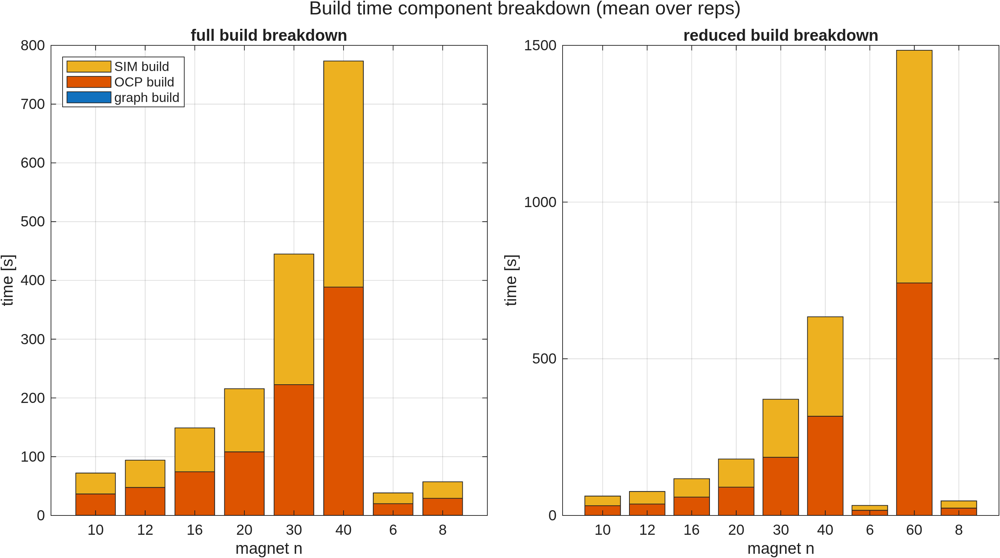
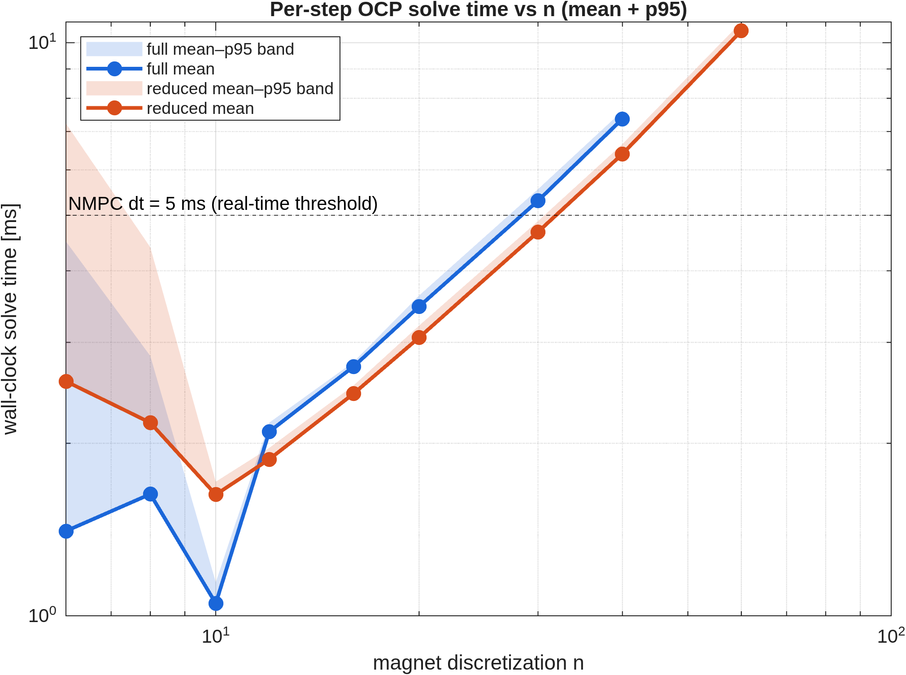
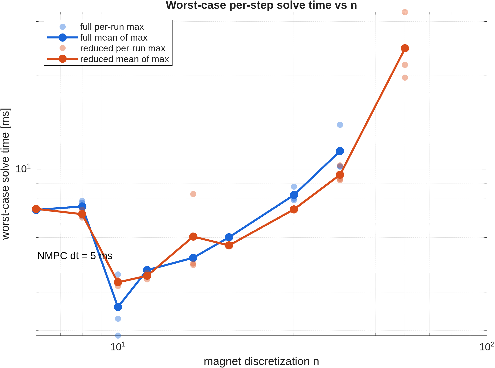
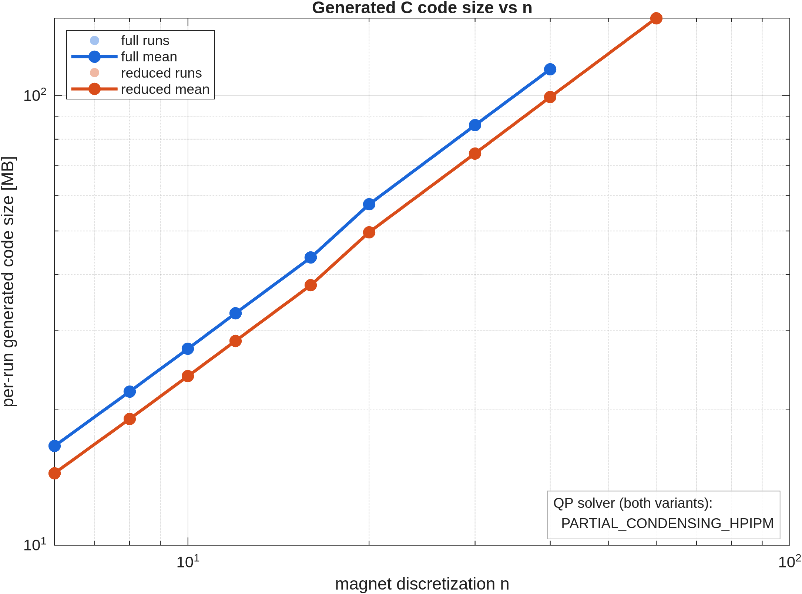
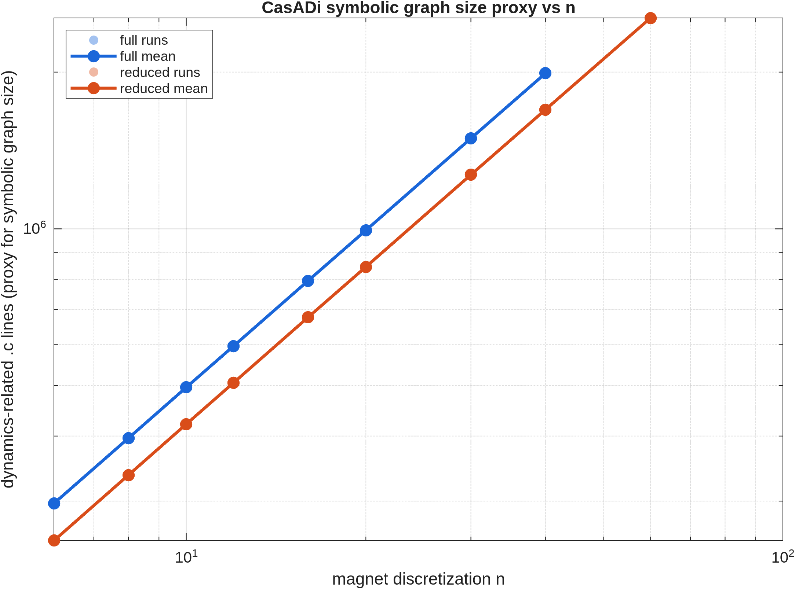
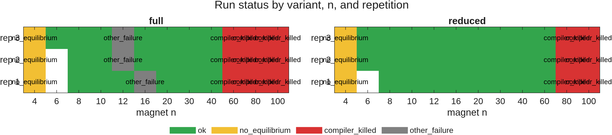

# `n`-Sweep Analysis: NMPC for the 6-DOF Maglev System

**Author:** Marius Jullum Faanes
**Date:** 2026-05-21
**Sources:** `magnet_n_sweep_summary.csv`, `aggregated.csv`,
`per_run_with_code_size.csv`, archived `generated_code/<run_id>/`, sweep logs
`magnet_n_sweep_log_20260520_*.txt` and `..._20260521_*.txt`.

This document accompanies the figures in this directory and is intended as
thesis-presentation material. All plots and tables are produced by
`analyze_sweep.m` — re-run that script to regenerate everything from the raw
CSV.

> **Sweep provenance.** This is the post-fix re-run of 2026-05-20 → 2026-05-21.
> Two changes were applied relative to the prior sweep:
>
> 1. **CasADi introspection metrics are now logged** in the summary CSV
>    (`n_instructions`, `n_nodes`, `nnz_jac_x`, `nnz_jac_u`) — these replace
>    the indirect `.c`-line-count proxy used previously.
> 2. **Model `.c` files are compiled with `-O1`** instead of acados' default
>    `-O2`, recorded in the new `ext_fun_compile_flags` column. The intent
>    was to reduce gcc's optimisation-pass memory footprint and raise the
>    `n` ceiling that previously failed under OOM-kill.
>
> Both halves of the sweep (full and reduced) were re-run together on the
> same machine; numbers below are not directly comparable to those in the
> prior write-up.

---

## 1. Experimental setup

The sweep covered the magnet-circumference discretization parameter `n`
(used by the trapezoidal integration over the levitating magnet's surface
current) for two NMPC formulations of the same physical system:

| Variant | States | Dynamics                                             | QP solver                  |
| ------- | ------ | ---------------------------------------------------- | -------------------------- |
| full    | 12     | `[x y z α β γ vx vy vz ωx ωy ωz]`                    | `PARTIAL_CONDENSING_HPIPM` |
| reduced | 10     | `[x y z α β vx vy vz ωx ωy]` (γ and ωz dropped)      | `PARTIAL_CONDENSING_HPIPM` |

Both variants use the same QP solver (`run_magnet_n_sweep.m` lines 285 and
367), so the full-vs-reduced comparison remains a clean dynamics-only one.

Common OCP settings: N = 10 horizon nodes, Tf = 0.05 s (dt = 5 ms), SQP-RTI,
IRK Gauss–Legendre integrator, NONLINEAR_LS cost, control bounds ±1 A on
each of the 4 solenoids, state box bounds on position and tilt.
**`ext_fun_compile_flags = "-O1"`** on every successful build in this sweep.

Sweep grid: `n ∈ {4, 6, 8, 10, 12, 16, 20, 30, 40, 60, 80, 100}` × 3
repetitions × {full, reduced} = 72 attempts in the plan. The CSV holds 77
rows (a handful of resumed retries are present).

**45 / 77 attempted runs completed successfully.** The remaining 32 break
down as 6 `no_equilibrium` (all n = 4), 15 `compiler_killed`, and 11
`other_failure` (mixed: sim-solver compile fails at high n, one cwd error,
four stale rows with empty error messages). See §6.

---

## 2. Build time vs n

| n  | full OCP-build [s] | reduced OCP-build [s] | reduced / full |
| -- | ------------------ | --------------------- | -------------- |
|  8 |  28.8              |  23.2                 | 0.81           |
| 10 |  36.3              |  30.9                 | 0.85           |
| 16 |  74.2              |  58.5                 | 0.79           |
| 20 | 108.1              |  90.1                 | 0.83           |
| 30 | 222.4              | 185.4                 | 0.83           |
| 40 | 388.5              | 316.3                 | 0.81           |
| 60 | —                  | 741.8                 | —              |

**The `-O1` switch shaved ≈44 % off the total build wall time at every n.**
At n = 40 the full variant now takes 773 s total vs 1374 s under `-O2` in
the prior sweep; the reduced variant takes 634 s vs 1111 s. The
optimisation-flag change is a clean constant-factor shift downward.

The two compile halves remain balanced: at every n the **OCP shared-library
build and the IRK simulator shared-library build take essentially the same
wall time** (e.g. at full n = 40, 388.5 s OCP vs 384.7 s sim; at reduced
n = 40, 316.3 vs 317.5 s). CasADi graph construction is unchanged at ≈ 0.2 s
throughout.

On log–log axes the slope is **unchanged from the `-O2` sweep**: regressing
full n = 10 → 40 gives an exponent of ≈ 1.71 (×10.76 over ×4); n = 20 → 40
gives ≈ 1.84 (×3.59 over ×2). The reduced variant now extends one decade
further: n = 10 → 60 grows ×24.04 over ×6, exponent ≈ 1.78. Build time is
therefore still **super-linear and approaching n² at large n** — `-O1`
moved the curve down but did not flatten it. That is the expected outcome:
the scaling exponent is set by file *size*, and `-O1` only changes how
much CPU each line costs the optimiser.

The reduced model is **consistently ~17 – 21 % faster to build** than the
full model at every successful n (mean ratio 0.82 across the table above),
because dropping γ and ωz removes two columns from the Jacobian and
shortens the auto-generated expressions.

---

## 3. Solve time vs n

| n  | full mean [ms] | reduced mean [ms] | full p95 [ms] | reduced p95 [ms] |
| -- | -------------- | ----------------- | ------------- | ---------------- |
|  6 | 1.30 (1 rep)   | 2.48              | 4.49          | 7.22             |
|  8 | 1.54           | 2.08              | 2.04          | 4.34             |
| 10 | 1.04           | 1.61              | 1.13          | 1.70             |
| 12 | 2.08 (1 rep)   | 1.86              | 2.15          | 1.94             |
| 16 | 2.71           | 2.43              | 2.76          | 2.51             |
| 20 | 3.45           | 3.04              | 3.59          | 3.19             |
| 30 | 5.28           | 4.66              | 5.52          | 4.86             |
| 40 | 7.34           | 6.38              | 7.58          | 6.63             |
| 60 | —              | 10.45             | —             | 10.87            |

Despite the weaker compiler optimisation, **per-step solve time is not
materially worse and in places slightly faster** than under `-O2` (e.g.
full n = 40 mean went from 7.50 ms → 7.34 ms). For tight inner loops the
acados / HPIPM hot paths are already heavily hand-tuned (BLASFEO kernels,
hand-unrolled HPIPM routines), so `-O2 → -O1` on the model code costs
little at run-time.

From n ≥ 10 onward the mean per-step OCP solve time grows
**approximately linearly in n** for both variants. Across n = 20 → 40 (×2)
the full mean grows ×2.13 and the reduced mean ×2.10 — essentially linear.
The reduced variant now extends the linear trend one decade further:
n = 20 → 60 (×3) grows ×3.44.

The small-n anomaly persists: at **n = 6 and n = 8 the reduced variant is
slower than full**, and p95 columns show a large first-call outlier for
both variants. With identical QP machinery on both sides this is a
startup / warm-up effect (first QP factorisation, cache warm-up of the
freshly loaded shared library) and washes out by n ≥ 10. Note also that
n = 6 / n = 12 / n = 16 for the full variant have only 1 or 2 surviving
reps (see §6), so their statistics carry more noise than the
3-reps-each rows.

The dashed line in `solve_time.png` marks the controller sample time
**dt = 5 ms**. The mean solve time crosses 5 ms at **n ≈ 30 for both
variants** (full 5.28 ms, reduced 4.66 ms); the p95 crosses 5 ms
**between n = 20 and n = 30** for full and at **n = 30 – 40** for reduced.
For a hard real-time deadline at dt = 5 ms, the controller is safe up to
**n ≈ 20**; above that, individual steps will start to miss. The reduced
variant runs solidly above 10 ms / step at n = 60 — useful for offline
high-fidelity studies but no longer real-time.

From n ≥ 10 the reduced model is **~12 – 14 % faster than full** at every
n. With identical QP machinery on both sides, this is attributable to the
smaller Jacobian (`nnz_jac_x = 30` vs `48`, `nnz_jac_u = 20` vs `24`) and
the slightly smaller condensed QP downstream.

---

## 4. Generated C code size vs n

> **Important caveat (carried over).** The `generated_code_bytes` column in
> the CSV measures the size of the entire archived `c_generated_code/<run_id>/`
> directory at archive time, which contains residue from earlier runs and
> overestimates per-run code size by 10–80×. The plot above uses the
> corrected metric `per_run_bytes` (computed by `measure_generated_code.m`)
> that only counts files whose name contains the specific `run_id`.

After this correction:

| n  | full per-run [MB] | reduced per-run [MB] | reduced / full |
| -- | ----------------- | -------------------- | -------------- |
|  6 |  16.6             |  14.5                | 0.87           |
| 10 |  27.3             |  23.8                | 0.87           |
| 16 |  43.6             |  37.9                | 0.87           |
| 20 |  57.3             |  49.7                | 0.87           |
| 30 |  86.0             |  74.4                | 0.86           |
| 40 | 114.5             |  99.3                | 0.87           |
| 60 | —                 | 148.7                | —              |

The reduced model is **a remarkably stable ~13 % smaller per run** than
the full model at every n. Per-run code size scales close to linearly with
`n` (full ×6.90 from n = 6 to n = 40 over ×6.67 n range; reduced ×10.26
from n = 6 to n = 60 over ×10), in line with the direct symbolic graph
metric in §5.

---

## 5. Symbolic graph size (now measured directly)

This section was previously a `.c`-line-count proxy. With introspection
metrics now logged, the symbolic graph is measured directly via CasADi's
`n_instructions()` / `n_nodes()` on the implicit-DAE function:

| n  | full `n_instructions` | reduced `n_instructions` | reduced / full | full `nnz_jac_x` | reduced `nnz_jac_x` |
| -- | --------------------- | ------------------------ | -------------- | ---------------- | ------------------- |
|  6 |   6 628               |   6 522                  | 0.984          | 48               | 30                  |
| 10 |  10 971               |  10 821                  | 0.986          | 48               | 30                  |
| 20 |  21 810               |  21 552                  | 0.988          | 48               | 30                  |
| 30 |  32 695               |  32 325                  | 0.989          | 48               | 30                  |
| 40 |  43 506               |  43 028                  | 0.989          | 48               | 30                  |
| 60 |  —                    |  64 520                  | —              | 48               | 30                  |

(`n_nodes` tracks `n_instructions` within ≈ 12 throughout, so it adds no
information here.)

Going from n = 6 to n = 40 (×6.67) multiplies `n_instructions` by
**×6.56 (full) and ×6.60 (reduced)**; reduced n = 6 → 60 multiplies it by
**×9.89 (vs ×10)**. The DAE expression graph grows **essentially exactly
linearly with n**, which is the textbook scaling for a trapezoidal sum
over `n` evaluations of a fixed-size integrand.

**The new direct metric tells a sharper story than the old line-count
proxy.** Reduced / full at the *graph* level is only **~1 %** smaller —
the symbolic dynamics of the two variants share virtually all of their
arithmetic, because the n-dependent magnetic-field subgraph is identical
across variants and dominates the count. The **~13 – 17 % reduced-model
advantage on every cost metric (build time, solve time, code size) is
therefore almost entirely a Jacobian-emission and downstream-QP effect**,
not a graph-evaluation effect: `nnz_jac_x` shrinks from 48 → 30 (−38 %)
and `nnz_jac_u` from 24 → 20 (−17 %). Dropping γ and ωz removes whole
Jacobian columns even though the underlying scalar expression set barely
changes.

The linear growth of the symbolic graph is the underlying driver of the
linear growth in solve time (§3) and code size (§4). The super-linear
growth in *build* time (§2) is therefore attributable to the compiler's
non-linear cost in processing larger source files — `-O1` did not change
this exponent, only its constant factor.

---

## 6. Failure modes

The 32 failed runs in this sweep fall into three categories:

**`no_equilibrium` (6 runs: full n = 4 × 3, reduced n = 4 × 3).** Same
physical failure as before. `computeSystemEquilibria` finds no real
equilibrium for n = 4 and the script aborts with
`Output argument "c" not assigned`. This is a *physical* failure of the
trapezoidal field model at very coarse circumference discretization; not
addressed by either fix.

**`compiler_killed` (15 runs, all OOM-kills of cc1 on `_impl_dae_*.c`):**

| variant | n   | killed reps | prior sweep |
| ------- | --- | ----------- | ----------- |
| full    |  60 | 3 / 3       | 1 / 3       |
| full    |  80 | 3 / 3       | (not run)   |
| full    | 100 | 3 / 3       | (not run)   |
| reduced |  60 | 0 / 3 ✅    | 3 / 3       |
| reduced |  80 | 3 / 3       | 3 / 3       |
| reduced | 100 | 3 / 3       | 3 / 3       |

The **headline win of `-O1` is reduced n = 60**: previously OOM-killed in
3/3 reps, now compiles cleanly in 3/3 reps (≈ 1484 s total build, ≈ 149 MB
per run). The fix bought one extra `n` step for reduced.

The **headline disappointment** is that **full n = 60 still cannot be
built**: under `-O2` the prior sweep got 1/3 successes, this `-O1` re-run
got 0/3. The full variant has the larger Jacobian (`nnz_jac_x = 48` vs
`30`) and therefore a larger `_impl_dae_jac_x_xdot_u_z.c` file; the
optimisation-pass memory headroom that `-O1` recovered (≈40 %) was
insufficient to clear it. n = 80 and n = 100 remain unreachable for both
variants.

**`other_failure` (11 runs).** Mixed bag: two are OOM-kills that
manifested on the *sim-solver* shared-library build rather than the OCP
build (full n = 12 rep03, full n = 16 rep01); one is a `cd` filesystem
error (full n = 12 rep02); four are stale rows with empty error messages
from interrupted/resumed attempts; the remaining four cluster at small n
(full n = 6 reps 1/2, reduced n = 6 rep01) and look like resumed-run
bookkeeping artefacts — those `(variant, n, rep)` triples also have a
successful row elsewhere in the CSV.

There were no convergence / numerical failures of the OCP solver itself
in the successful builds — every successful build produced a closed-loop
trajectory through all 2000 simulation steps.

---

## 7. Full vs reduced — summary at n = 40

| Metric (at n = 40)         | full     | reduced  | reduced advantage |
| -------------------------- | -------- | -------- | ----------------- |
| OCP build time             | 388.5 s  | 316.3 s  | −19 %             |
| sim build time             | 384.7 s  | 317.5 s  | −17 %             |
| total build time           | 773.2 s  | 633.8 s  | −18 %             |
| solve time (mean)          | 7.34 ms  | 6.38 ms  | −13 %             |
| solve time (p95)           | 7.58 ms  | 6.63 ms  | −13 %             |
| per-run code size          | 114.5 MB |  99.3 MB | −13 %             |
| `n_instructions`           |  43 506  |  43 028  | −1.1 %            |
| `nnz_jac_x`                |  48      |  30      | −38 %             |
| max successful n           | 40       | 60       | +1 step           |

The reduced model is a consistent **~13 – 19 % win on every observable
cost metric**, but the new introspection metrics reveal that this wins
**almost entirely through Jacobian sparsity, not symbolic graph size**.
The dynamics expression graph itself is only ~1 % smaller; the cost
reductions all flow downstream from emitting two fewer Jacobian columns
and feeding a slightly smaller condensed QP.

The reduced model now extends the maximum tractable n from 40 to 60 — a
real but modest gain.

---

## 8. Can the code-size explosion be circumvented?

Status of the suggestions from the prior analysis, and the remaining
options.

✅ **Applied: `-O1` compile flag for model `.c` files.** Measured impact:
≈ 44 % reduction in build wall time at every n, no measurable runtime
penalty (mean solve at n = 40 actually *improved* slightly), and a
**one-step extension of the reduced-variant n ceiling (40 → 60).** It did
not extend the full variant's ceiling, because the full Jacobian file is
larger than `-O1` could shrink-fit into the available RAM. The scaling
exponent of build time is **unchanged**: `-O1` is a constant-factor
discount, not a regime change. `-O0` would presumably extend the ceiling
further at greater runtime cost — worth a small follow-up data point.

🔲 **Remaining: split the dynamics into a precompiled external CasADi
shared library.** Still the most promising lever for a regime change.
acados supports `EXTERNAL` cost / dynamics where the model functions live
in their own `.so` produced by CasADi's own code-generator (which writes
smaller files because it doesn't inline through acados' templating). This
converts the giant single translation unit into many small ones — the
strongest play for raising the practical n ceiling further.

🔲 **Remaining: symbolic simplification of the trapezoidal sum.** The
dynamics graph re-instantiates the per-point field integrand `n` times. A
`casadi.Function` wrapper plus `mapaccum` / `map` would let CasADi share
the subgraph and emit a single compiled per-point function called n times
at run-time. Combined with `-O1`, this might be enough to reach n = 100.

🔲 **Remaining: lower the horizon `N` or use 1-stage IRK.** Both directly
multiply the per-node dynamics cost; halving N halves the OCP file size.
Control-side mitigation, not codegen-side.

🔲 **Remaining: experiment with condensing strategy.** Both variants
currently use `PARTIAL_CONDENSING_HPIPM`. Switching the reduced variant
to `FULL_CONDENSING_HPIPM` (small dense problem, nx = 10, N = 10) might
be faster at the QP step but does *not* change the `_impl_dae_*` file
that triggers the OOM, so would not raise the n ceiling.

---

## 9. Recommendations for the thesis

* The headline finding is **unchanged in shape**: build time grows
  super-linearly (≈ n¹·⁷ – n¹·⁹) while solve time and graph size grow
  linearly. `-O1` was a clean **constant-factor** win on build time
  (≈ 0.55×) with no observable runtime cost, but it did not flatten any
  exponent.
* The reduced 10-state model is still a uniform **~13 – 19 % win** on
  cost metrics. The new introspection data sharpens the explanation:
  almost all of the saving is **Jacobian sparsity** (`nnz_jac_x` 48 → 30),
  not expression-graph size (`n_instructions` differs by only ~1 %). For
  the thesis, this is a better-told story than "the reduced model has a
  smaller graph" — it is essentially the same graph fed into a smaller QP.
* The hard ceiling has moved by exactly one `n` step: **reduced 40 → 60**;
  **full 40 unchanged** (the prior 1/3 success at full n = 60 was lucky
  and did not reproduce). Compile-time gcc memory pressure remains the
  binding constraint.
* Real-time feasibility at dt = 5 ms is unchanged: mean solve crosses
  dt = 5 ms at **n ≈ 30** and p95 already between **n = 20 and 30**, so
  the compile ceiling is not the binding constraint for closed-loop
  performance — it still gates higher-fidelity *offline* studies.
* The small-n solve-time anomaly (reduced slower than full at n = 6, 8
  and large p95 first-call spikes) persists and is best read as a
  startup / warm-up effect.
* If a follow-up sweep is to be run, two concrete changes would yield
  cleaner data:
  1. **Clean `c_generated_code/` between runs** so the archived
     `generated_code_bytes` column matches per-run reality without the
     post-hoc `measure_generated_code.m` filter.
  2. **Add an `-O0` data point at n = 40 and n = 60** to see whether the
     full variant's n = 60 OOM can be defeated by dropping optimisation
     further — and to quantify the runtime penalty of doing so.
