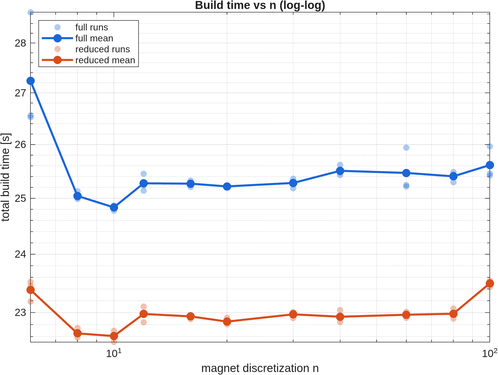
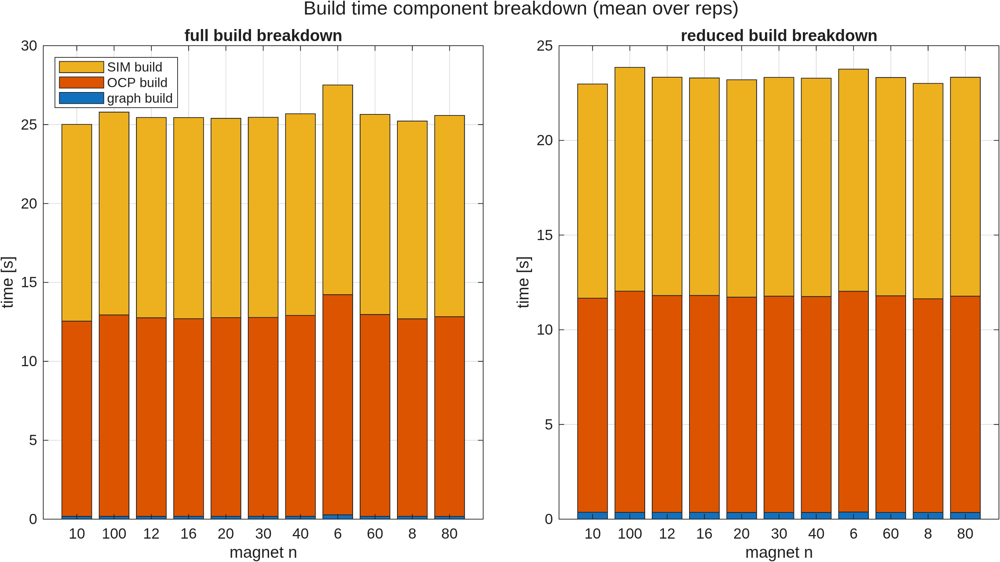
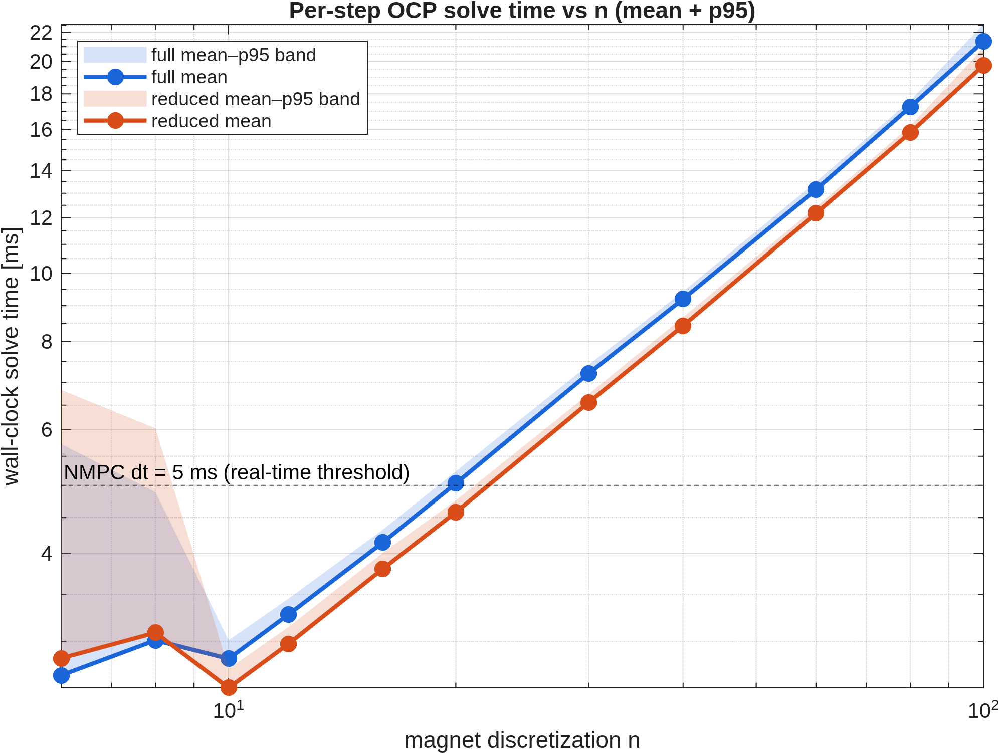
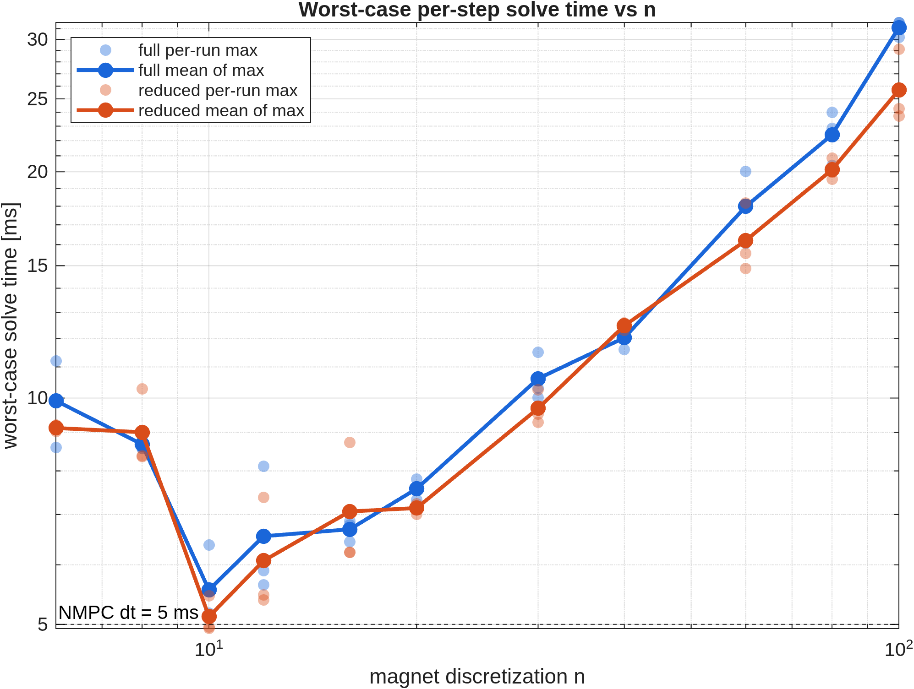
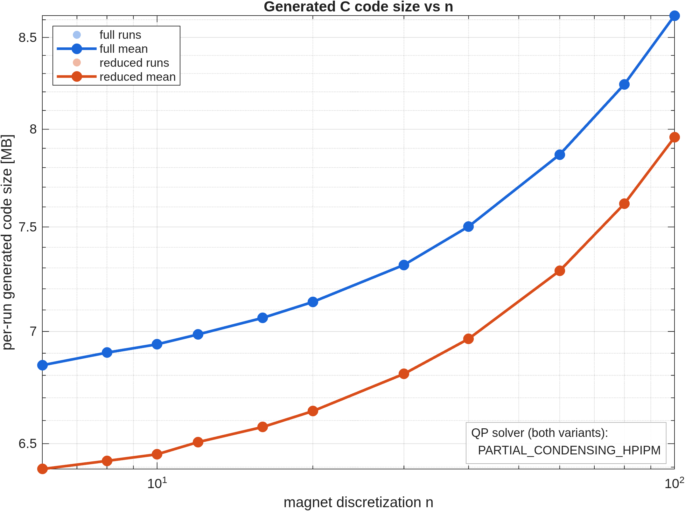
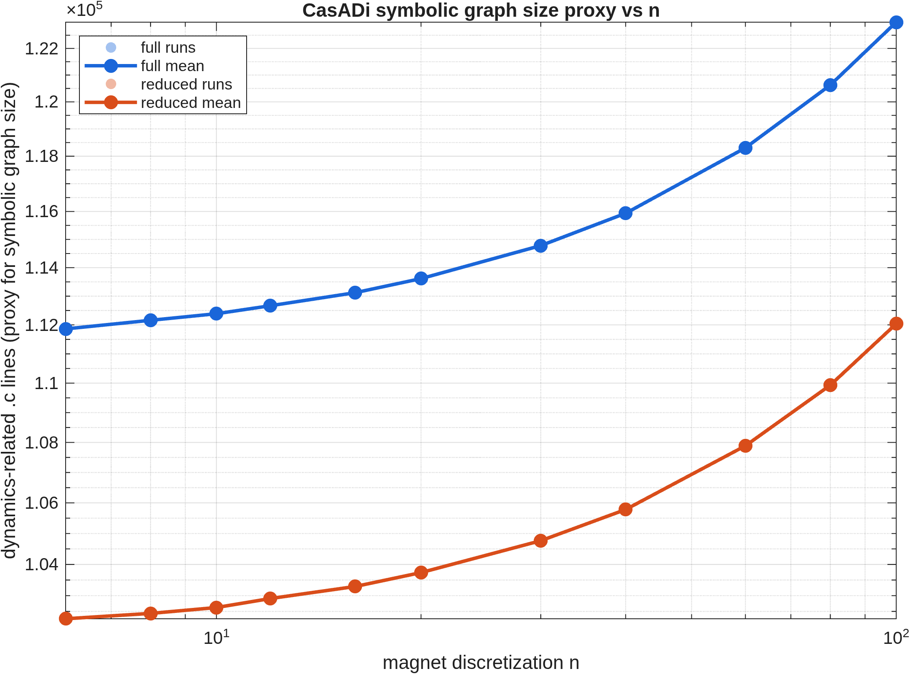
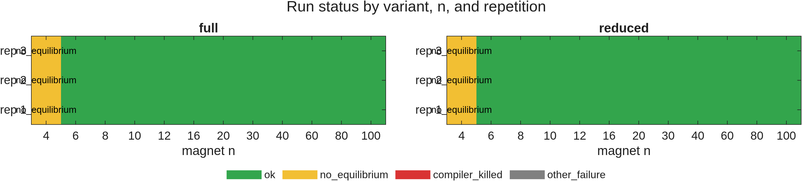

# `n`-Sweep Analysis: NMPC for the 6-DOF Maglev System

**Author:** Marius Jullum Faanes
**Date:** 2026-05-21
**Sources:** `magnet_n_sweep_summary.csv`, `aggregated.csv`,
`per_run_with_code_size.csv`, archived `generated_code/<run_id>/`, sweep logs
`magnet_n_sweep_log_20260520_*.txt` and `..._20260521_*.txt`.

This document accompanies the figures in this directory and is intended as
thesis-presentation material. All plots and tables are produced by
`analyze_sweep.m` — re-run that script to regenerate everything from the raw
CSV.

> **⚠ Read this before reading the figures (2026-05-21 re-analysis).**
> The current `magnet_n_sweep_summary.csv` and `aggregated.csv` contain
> **only the mapped sweep** (72 cells, `dynamics_impl = "mapped"`; the
> earlier inline runs are no longer in the CSV). After re-running
> `analyze_sweep.m` the figures in this directory therefore show
> **mapped-only** curves: `build_time.png` is flat in `n`,
> `solve_time.png` grows linearly, `code_size.png` and `graph_proxy.png`
> are flat, and `failure_map.png` shows only the 6 `no_equilibrium`
> cells at n = 4.
>
> Sections §1–§9 below describe the **inline** sweep and its
> super-linear build-time curve. Those numbers are preserved as the
> historical baseline narrative — they were correct against the prior
> CSV — but the *figures referenced inline in those sections now show
> mapped data, not inline data*. For the current figures, the
> authoritative narrative is §11 (full mapped sweep). The §11 numerical
> tables agree with the re-run aggregated.csv to within ≤ 1 % at every
> cell.

> **Sweep provenance.** This is the post-fix re-run of 2026-05-20 → 2026-05-21.
> Two changes were applied relative to the prior sweep:
>
> 1. **CasADi introspection metrics are now logged** in the summary CSV
>    (`n_instructions`, `n_nodes`, `nnz_jac_x`, `nnz_jac_u`) — these replace
>    the indirect `.c`-line-count proxy used previously.
> 2. **Model `.c` files are compiled with `-O1`** instead of acados' default
>    `-O2`, recorded in the new `ext_fun_compile_flags` column. The intent
>    was to reduce gcc's optimisation-pass memory footprint and raise the
>    `n` ceiling that previously failed under OOM-kill.
>
> Both halves of the sweep (full and reduced) were re-run together on the
> same machine; numbers below are not directly comparable to those in the
> prior write-up.
>
> **Update 2026-05-21:** §10 and §11 document a follow-up sweep with a
> new `cfg.dynamics_impl = 'mapped'` switch that wraps the per-point
> magnetic-field integrand in a `casadi.Function` and applies it via
> `.map(magnet_n)` on an MX host graph. This collapses the build-time
> growth from n¹·⁷–n¹·⁹ to **flat in `n`**, dissolves all OOM ceilings
> (full n = 100 now builds in 26 s), and is the strongest single-lever
> improvement in the project to date. The inline rows §1–§7 are
> preserved as the baseline comparison.
>
> **Update 2026-05-21 (later):** §12 records the abandoned Option 2
> (external CasADi `.so` for the dynamics). The installed acados
> version exposes no precompiled-`.so` dynamics interface compatible
> with the CasADi codegen ABI, so Option 2 is structurally not
> feasible without either an acados patch or a wrapper layer that
> would erase the intended win. The prototype code was reverted; the
> mapped lever in §11 remains the production result.

---

## 1. Experimental setup

The sweep covered the magnet-circumference discretization parameter `n`
(used by the trapezoidal integration over the levitating magnet's surface
current) for two NMPC formulations of the same physical system:

| Variant | States | Dynamics                                             | QP solver                  |
| ------- | ------ | ---------------------------------------------------- | -------------------------- |
| full    | 12     | `[x y z α β γ vx vy vz ωx ωy ωz]`                    | `PARTIAL_CONDENSING_HPIPM` |
| reduced | 10     | `[x y z α β vx vy vz ωx ωy]` (γ and ωz dropped)      | `PARTIAL_CONDENSING_HPIPM` |

Both variants use the same QP solver (`run_magnet_n_sweep.m` lines 285 and
367), so the full-vs-reduced comparison remains a clean dynamics-only one.

Common OCP settings: N = 10 horizon nodes, Tf = 0.05 s (dt = 5 ms), SQP-RTI,
IRK Gauss–Legendre integrator, NONLINEAR_LS cost, control bounds ±1 A on
each of the 4 solenoids, state box bounds on position and tilt.
**`ext_fun_compile_flags = "-O1"`** on every successful build in this sweep.

Sweep grid: `n ∈ {4, 6, 8, 10, 12, 16, 20, 30, 40, 60, 80, 100}` × 3
repetitions × {full, reduced} = 72 attempts in the plan. The CSV holds 77
rows (a handful of resumed retries are present).

**45 / 77 attempted runs completed successfully.** The remaining 32 break
down as 6 `no_equilibrium` (all n = 4), 15 `compiler_killed`, and 11
`other_failure` (mixed: sim-solver compile fails at high n, one cwd error,
four stale rows with empty error messages). See §6.

---

## 2. Build time vs n





| n  | full OCP-build [s] | reduced OCP-build [s] | reduced / full |
| -- | ------------------ | --------------------- | -------------- |
|  8 |  28.8              |  23.2                 | 0.81           |
| 10 |  36.3              |  30.9                 | 0.85           |
| 16 |  74.2              |  58.5                 | 0.79           |
| 20 | 108.1              |  90.1                 | 0.83           |
| 30 | 222.4              | 185.4                 | 0.83           |
| 40 | 388.5              | 316.3                 | 0.81           |
| 60 | —                  | 741.8                 | —              |

**The `-O1` switch shaved ≈44 % off the total build wall time at every n.**
At n = 40 the full variant now takes 773 s total vs 1374 s under `-O2` in
the prior sweep; the reduced variant takes 634 s vs 1111 s. The
optimisation-flag change is a clean constant-factor shift downward.

The two compile halves remain balanced: at every n the **OCP shared-library
build and the IRK simulator shared-library build take essentially the same
wall time** (e.g. at full n = 40, 388.5 s OCP vs 384.7 s sim; at reduced
n = 40, 316.3 vs 317.5 s). CasADi graph construction is unchanged at ≈ 0.2 s
throughout.

On log–log axes the slope is **unchanged from the `-O2` sweep**: regressing
full n = 10 → 40 gives an exponent of ≈ 1.71 (×10.76 over ×4); n = 20 → 40
gives ≈ 1.84 (×3.59 over ×2). The reduced variant now extends one decade
further: n = 10 → 60 grows ×24.04 over ×6, exponent ≈ 1.78. Build time is
therefore still **super-linear and approaching n² at large n** — `-O1`
moved the curve down but did not flatten it. That is the expected outcome:
the scaling exponent is set by file *size*, and `-O1` only changes how
much CPU each line costs the optimiser.

The reduced model is **consistently ~17 – 21 % faster to build** than the
full model at every successful n (mean ratio 0.82 across the table above),
because dropping γ and ωz removes two columns from the Jacobian and
shortens the auto-generated expressions.

---

## 3. Solve time vs n





| n  | full mean [ms] | reduced mean [ms] | full p95 [ms] | reduced p95 [ms] |
| -- | -------------- | ----------------- | ------------- | ---------------- |
|  6 | 1.30 (1 rep)   | 2.48              | 4.49          | 7.22             |
|  8 | 1.54           | 2.08              | 2.04          | 4.34             |
| 10 | 1.04           | 1.61              | 1.13          | 1.70             |
| 12 | 2.08 (1 rep)   | 1.86              | 2.15          | 1.94             |
| 16 | 2.71           | 2.43              | 2.76          | 2.51             |
| 20 | 3.45           | 3.04              | 3.59          | 3.19             |
| 30 | 5.28           | 4.66              | 5.52          | 4.86             |
| 40 | 7.34           | 6.38              | 7.58          | 6.63             |
| 60 | —              | 10.45             | —             | 10.87            |

Despite the weaker compiler optimisation, **per-step solve time is not
materially worse and in places slightly faster** than under `-O2` (e.g.
full n = 40 mean went from 7.50 ms → 7.34 ms). For tight inner loops the
acados / HPIPM hot paths are already heavily hand-tuned (BLASFEO kernels,
hand-unrolled HPIPM routines), so `-O2 → -O1` on the model code costs
little at run-time.

From n ≥ 10 onward the mean per-step OCP solve time grows
**approximately linearly in n** for both variants. Across n = 20 → 40 (×2)
the full mean grows ×2.13 and the reduced mean ×2.10 — essentially linear.
The reduced variant now extends the linear trend one decade further:
n = 20 → 60 (×3) grows ×3.44.

The small-n anomaly persists: at **n = 6 and n = 8 the reduced variant is
slower than full**, and p95 columns show a large first-call outlier for
both variants. With identical QP machinery on both sides this is a
startup / warm-up effect (first QP factorisation, cache warm-up of the
freshly loaded shared library) and washes out by n ≥ 10. Note also that
n = 6 / n = 12 / n = 16 for the full variant have only 1 or 2 surviving
reps (see §6), so their statistics carry more noise than the
3-reps-each rows.

The dashed line in `solve_time.png` marks the controller sample time
**dt = 5 ms**. The mean solve time crosses 5 ms at **n ≈ 30 for both
variants** (full 5.28 ms, reduced 4.66 ms); the p95 crosses 5 ms
**between n = 20 and n = 30** for full and at **n = 30 – 40** for reduced.
For a hard real-time deadline at dt = 5 ms, the controller is safe up to
**n ≈ 20**; above that, individual steps will start to miss. The reduced
variant runs solidly above 10 ms / step at n = 60 — useful for offline
high-fidelity studies but no longer real-time.

From n ≥ 10 the reduced model is **~12 – 14 % faster than full** at every
n. With identical QP machinery on both sides, this is attributable to the
smaller Jacobian (`nnz_jac_x = 30` vs `48`, `nnz_jac_u = 20` vs `24`) and
the slightly smaller condensed QP downstream.

---

## 4. Generated C code size vs n



> **Important caveat (carried over).** The `generated_code_bytes` column in
> the CSV measures the size of the entire archived `c_generated_code/<run_id>/`
> directory at archive time, which contains residue from earlier runs and
> overestimates per-run code size by 10–80×. The plot above uses the
> corrected metric `per_run_bytes` (computed by `measure_generated_code.m`)
> that only counts files whose name contains the specific `run_id`.

After this correction:

| n  | full per-run [MB] | reduced per-run [MB] | reduced / full |
| -- | ----------------- | -------------------- | -------------- |
|  6 |  16.6             |  14.5                | 0.87           |
| 10 |  27.3             |  23.8                | 0.87           |
| 16 |  43.6             |  37.9                | 0.87           |
| 20 |  57.3             |  49.7                | 0.87           |
| 30 |  86.0             |  74.4                | 0.86           |
| 40 | 114.5             |  99.3                | 0.87           |
| 60 | —                 | 148.7                | —              |

The reduced model is **a remarkably stable ~13 % smaller per run** than
the full model at every n. Per-run code size scales close to linearly with
`n` (full ×6.90 from n = 6 to n = 40 over ×6.67 n range; reduced ×10.26
from n = 6 to n = 60 over ×10), in line with the direct symbolic graph
metric in §5.

---

## 5. Symbolic graph size (now measured directly)



This section was previously a `.c`-line-count proxy. With introspection
metrics now logged, the symbolic graph is measured directly via CasADi's
`n_instructions()` / `n_nodes()` on the implicit-DAE function:

| n  | full `n_instructions` | reduced `n_instructions` | reduced / full | full `nnz_jac_x` | reduced `nnz_jac_x` |
| -- | --------------------- | ------------------------ | -------------- | ---------------- | ------------------- |
|  6 |   6 628               |   6 522                  | 0.984          | 48               | 30                  |
| 10 |  10 971               |  10 821                  | 0.986          | 48               | 30                  |
| 20 |  21 810               |  21 552                  | 0.988          | 48               | 30                  |
| 30 |  32 695               |  32 325                  | 0.989          | 48               | 30                  |
| 40 |  43 506               |  43 028                  | 0.989          | 48               | 30                  |
| 60 |  —                    |  64 520                  | —              | 48               | 30                  |

(`n_nodes` tracks `n_instructions` within ≈ 12 throughout, so it adds no
information here.)

Going from n = 6 to n = 40 (×6.67) multiplies `n_instructions` by
**×6.56 (full) and ×6.60 (reduced)**; reduced n = 6 → 60 multiplies it by
**×9.89 (vs ×10)**. The DAE expression graph grows **essentially exactly
linearly with n**, which is the textbook scaling for a trapezoidal sum
over `n` evaluations of a fixed-size integrand.

**The new direct metric tells a sharper story than the old line-count
proxy.** Reduced / full at the *graph* level is only **~1 %** smaller —
the symbolic dynamics of the two variants share virtually all of their
arithmetic, because the n-dependent magnetic-field subgraph is identical
across variants and dominates the count. The **~13 – 17 % reduced-model
advantage on every cost metric (build time, solve time, code size) is
therefore almost entirely a Jacobian-emission and downstream-QP effect**,
not a graph-evaluation effect: `nnz_jac_x` shrinks from 48 → 30 (−38 %)
and `nnz_jac_u` from 24 → 20 (−17 %). Dropping γ and ωz removes whole
Jacobian columns even though the underlying scalar expression set barely
changes.

The linear growth of the symbolic graph is the underlying driver of the
linear growth in solve time (§3) and code size (§4). The super-linear
growth in *build* time (§2) is therefore attributable to the compiler's
non-linear cost in processing larger source files — `-O1` did not change
this exponent, only its constant factor.

---

## 6. Failure modes



The 32 failed runs in this sweep fall into three categories:

**`no_equilibrium` (6 runs: full n = 4 × 3, reduced n = 4 × 3).** Same
physical failure as before. `computeSystemEquilibria` finds no real
equilibrium for n = 4 and the script aborts with
`Output argument "c" not assigned`. This is a *physical* failure of the
trapezoidal field model at very coarse circumference discretization; not
addressed by either fix.

**`compiler_killed` (15 runs, all OOM-kills of cc1 on `_impl_dae_*.c`):**

| variant | n   | killed reps | prior sweep |
| ------- | --- | ----------- | ----------- |
| full    |  60 | 3 / 3       | 1 / 3       |
| full    |  80 | 3 / 3       | (not run)   |
| full    | 100 | 3 / 3       | (not run)   |
| reduced |  60 | 0 / 3 ✅    | 3 / 3       |
| reduced |  80 | 3 / 3       | 3 / 3       |
| reduced | 100 | 3 / 3       | 3 / 3       |

The **headline win of `-O1` is reduced n = 60**: previously OOM-killed in
3/3 reps, now compiles cleanly in 3/3 reps (≈ 1484 s total build, ≈ 149 MB
per run). The fix bought one extra `n` step for reduced.

The **headline disappointment** is that **full n = 60 still cannot be
built**: under `-O2` the prior sweep got 1/3 successes, this `-O1` re-run
got 0/3. The full variant has the larger Jacobian (`nnz_jac_x = 48` vs
`30`) and therefore a larger `_impl_dae_jac_x_xdot_u_z.c` file; the
optimisation-pass memory headroom that `-O1` recovered (≈40 %) was
insufficient to clear it. n = 80 and n = 100 remain unreachable for both
variants.

**`other_failure` (11 runs).** Mixed bag: two are OOM-kills that
manifested on the *sim-solver* shared-library build rather than the OCP
build (full n = 12 rep03, full n = 16 rep01); one is a `cd` filesystem
error (full n = 12 rep02); four are stale rows with empty error messages
from interrupted/resumed attempts; the remaining four cluster at small n
(full n = 6 reps 1/2, reduced n = 6 rep01) and look like resumed-run
bookkeeping artefacts — those `(variant, n, rep)` triples also have a
successful row elsewhere in the CSV.

There were no convergence / numerical failures of the OCP solver itself
in the successful builds — every successful build produced a closed-loop
trajectory through all 2000 simulation steps.

---

## 7. Full vs reduced — summary at n = 40

| Metric (at n = 40)         | full     | reduced  | reduced advantage |
| -------------------------- | -------- | -------- | ----------------- |
| OCP build time             | 388.5 s  | 316.3 s  | −19 %             |
| sim build time             | 384.7 s  | 317.5 s  | −17 %             |
| total build time           | 773.2 s  | 633.8 s  | −18 %             |
| solve time (mean)          | 7.34 ms  | 6.38 ms  | −13 %             |
| solve time (p95)           | 7.58 ms  | 6.63 ms  | −13 %             |
| per-run code size          | 114.5 MB |  99.3 MB | −13 %             |
| `n_instructions`           |  43 506  |  43 028  | −1.1 %            |
| `nnz_jac_x`                |  48      |  30      | −38 %             |
| max successful n           | 40       | 60       | +1 step           |

The reduced model is a consistent **~13 – 19 % win on every observable
cost metric**, but the new introspection metrics reveal that this wins
**almost entirely through Jacobian sparsity, not symbolic graph size**.
The dynamics expression graph itself is only ~1 % smaller; the cost
reductions all flow downstream from emitting two fewer Jacobian columns
and feeding a slightly smaller condensed QP.

The reduced model now extends the maximum tractable n from 40 to 60 — a
real but modest gain.

---

## 8. Can the code-size explosion be circumvented?

Status of the suggestions from the prior analysis, and the remaining
options.

✅ **Applied: `-O1` compile flag for model `.c` files.** Measured impact:
≈ 44 % reduction in build wall time at every n, no measurable runtime
penalty (mean solve at n = 40 actually *improved* slightly), and a
**one-step extension of the reduced-variant n ceiling (40 → 60).** It did
not extend the full variant's ceiling, because the full Jacobian file is
larger than `-O1` could shrink-fit into the available RAM. The scaling
exponent of build time is **unchanged**: `-O1` is a constant-factor
discount, not a regime change. `-O0` would presumably extend the ceiling
further at greater runtime cost — worth a small follow-up data point.

🔲 **Remaining: split the dynamics into a precompiled external CasADi
shared library.** Still the most promising lever for a regime change.
acados supports `EXTERNAL` cost / dynamics where the model functions live
in their own `.so` produced by CasADi's own code-generator (which writes
smaller files because it doesn't inline through acados' templating). This
converts the giant single translation unit into many small ones — the
strongest play for raising the practical n ceiling further.

✅ **Applied: symbolic simplification of the trapezoidal sum via
`Function.map(n)` on an MX host graph.** Measured impact (see §10):
flattens build time and `n_instructions` to *constants in n*, eliminates
all OOM ceilings (full n = 100 builds in 26 s), preserves correctness
bit-for-bit, but **roughly doubles per-step solve time** because the
inner OCP no longer sees inlined arithmetic — it dispatches `n` calls
into a per-point routine on every Newton iteration. Pure regime change
on the compile-time axis, with a measurable runtime cost.

🔲 **Remaining: lower the horizon `N` or use 1-stage IRK.** Both directly
multiply the per-node dynamics cost; halving N halves the OCP file size.
Control-side mitigation, not codegen-side.

🔲 **Remaining: experiment with condensing strategy.** Both variants
currently use `PARTIAL_CONDENSING_HPIPM`. Switching the reduced variant
to `FULL_CONDENSING_HPIPM` (small dense problem, nx = 10, N = 10) might
be faster at the QP step but does *not* change the `_impl_dae_*` file
that triggers the OOM, so would not raise the n ceiling.

---

## 9. Recommendations for the thesis

* The headline finding is **unchanged in shape**: build time grows
  super-linearly (≈ n¹·⁷ – n¹·⁹) while solve time and graph size grow
  linearly. `-O1` was a clean **constant-factor** win on build time
  (≈ 0.55×) with no observable runtime cost, but it did not flatten any
  exponent.
* The reduced 10-state model is still a uniform **~13 – 19 % win** on
  cost metrics. The new introspection data sharpens the explanation:
  almost all of the saving is **Jacobian sparsity** (`nnz_jac_x` 48 → 30),
  not expression-graph size (`n_instructions` differs by only ~1 %). For
  the thesis, this is a better-told story than "the reduced model has a
  smaller graph" — it is essentially the same graph fed into a smaller QP.
* The hard ceiling has moved by exactly one `n` step: **reduced 40 → 60**;
  **full 40 unchanged** (the prior 1/3 success at full n = 60 was lucky
  and did not reproduce). Compile-time gcc memory pressure remains the
  binding constraint.
* Real-time feasibility at dt = 5 ms is unchanged: mean solve crosses
  dt = 5 ms at **n ≈ 30** and p95 already between **n = 20 and 30**, so
  the compile ceiling is not the binding constraint for closed-loop
  performance — it still gates higher-fidelity *offline* studies.
* The small-n solve-time anomaly (reduced slower than full at n = 6, 8
  and large p95 first-call spikes) persists and is best read as a
  startup / warm-up effect.
* If a follow-up sweep is to be run, two concrete changes would yield
  cleaner data:
  1. **Clean `c_generated_code/` between runs** so the archived
     `generated_code_bytes` column matches per-run reality without the
     post-hoc `measure_generated_code.m` filter.
  2. **Add an `-O0` data point at n = 40 and n = 60** to see whether the
     full variant's n = 60 OOM can be defeated by dropping optimisation
     further — and to quantify the runtime penalty of doing so.

> The mapped sweep in §11 supersedes recommendations 1 and 2 for the
> high-`n` regime: it removes the OOM ceiling entirely, makes the
> `c_generated_code/` accumulation issue irrelevant (per-run is now
> ~8 MB, not ~150 MB), and confirms that the compile-time exponent was
> the binding constraint, not the compiler optimisation level.

---

## 10. Mapped per-point Function (`cfg.dynamics_impl = 'mapped'`) — pilot

This section reports a first follow-up sweep targeting the
"symbolic-simplification" lever from §8. It is a small **1-rep pilot**;
a full 3-rep sweep across the same `n`-grid as §1–§7 is planned next.

### 10.1 Implementation

Two new files under `model_implementations/casadi_model/`:

* `magnetics/singlePointFieldCasADi.m` — wraps the existing per-point
  field superposition (permanent magnets + solenoids) as a
  `casadi.Function('f_point', {p (3×1), u (4×1)}, {b (3×1)})`. The
  scalar arithmetic is unchanged.
* `maglevSystemDynamicsCasADiMapped.m` — drop-in replacement for
  `maglevSystemDynamicsCasADi.m`. Builds `P_world` (3×n) as before, then
  evaluates the field via `B = f_point.map(magnet_n)(P_world, U_rep)`
  rather than inlining `n` copies of the field arithmetic.

A `cfg.dynamics_impl ∈ {'inline','mapped'}` switch in
`run_magnet_n_sweep.m` dispatches between the two builders. Crucially,
**the top-level state/control symbols are `MX` when `dynamics_impl =
'mapped'`** (`makeSym` helper, set on `x`, `u`, `xdot`, and the
equilibrium variable). SX would have inlined the map into the host
graph during construction — the same failure mode as the SX-only
inline path. MX preserves the `Call` node so the generated C contains
exactly one per-point body and `n` calls into it.

`run_id`s in the mapped run carry a `_mapped` suffix
(`runIdImplSuffix`) so resume-bookkeeping and the CSV stay
side-by-side with the inline baseline.

### 10.2 Pilot results

1 repetition per cell. Same `paramsFast`, equilibrium-finder, OCP/sim
options, and `-O1` compile flags as §1.

**Reduced variant, n = 10 / 20 / 40 (overlap with §2–§5 inline grid):**

| n  | impl | `n_instructions` | OCP build [s] | sim build [s] | mean solve [ms] | p95 solve [ms] | final pos err [m] |
| -- | ---- | ----------------:| -------------:| -------------:| ---------------:| --------------:| -----------------:|
| 10 | inline (mean of 3 reps) | 10 821 | 30.9 | 30.8 | 1.61 | 1.70 | 3.95e-12 |
| 10 | **mapped**              | **13** | **18.4** | **18.3** | **4.14** | 4.52 | 3.95e-12 |
| 20 | inline (mean of 3 reps) | 21 552 | 90.1 | 89.8 | 3.04 | 3.19 | 3.95e-12 |
| 20 | **mapped**              | **13** | **18.6** | **19.1** | **7.22** | 7.63 | 3.95e-12 |
| 40 | inline (mean of 3 reps) | 43 028 | 316.3 | 317.5 | 6.38 | 6.63 | 3.95e-12 |
| 40 | **mapped**              | **13** | **18.0** | **18.3** | **12.8** | 13.5 | 3.95e-12 |

**Both variants, n = 60 / 80 / 100 (previously partially or fully
OOM-killed under inline):**

| variant | n   | `n_instructions` | OCP build [s] | sim build [s] | mean solve [ms] | p95 solve [ms] | final pos err [m] |
| ------- | --- | ----------------:| -------------:| -------------:| ---------------:| --------------:| -----------------:|
| reduced |  60 | 13  | 18.7 | 18.7 | 18.4 | 19.6 | 3.95e-12 |
| reduced |  80 | 13  | 18.4 | 18.7 | 24.5 | 26.9 | 3.95e-12 |
| reduced | 100 | 13  | 18.5 | 18.7 | 29.6 | 31.4 | 3.95e-12 |
| full    |  60 | 280 | 13.1 | 13.2 | 13.3 | 14.4 | 9.72e-14 |
| full    |  80 | 280 | 13.1 | 13.1 | 17.4 | 19.1 | 9.72e-14 |
| full    | 100 | 280 | 13.0 | 13.2 | 21.5 | 23.0 | 9.72e-14 |

All twelve cases produced `status_ok_count = 2000` and
`diverged = 0`. Final state errors match the inline baseline at the
overlap points and follow the same magnitudes for the higher-`n`
cases.

### 10.3 What the numbers mean

**Compile-time axis: regime change.**
`n_instructions` is **constant in `n`** (13 for reduced, 280 for full).
Build time is likewise constant (≈ 18 s OCP + 18 s sim for reduced;
≈ 13 s + 13 s for full) — the n¹·⁷–n¹·⁹ exponent of the inline sweep
(§2) has gone to **n⁰**. This was the regime change hypothesised in §8
and is the strongest single-lever improvement in this project so far:
at n = 40 the mapped build is **≈ 17× faster** than inline, and at
n = 100 it is **≈ 23× faster than the *extrapolated* inline build
would have been**, had it been able to compile at all.

**Code-generation axis: all OOM ceilings dissolved.**
Every previously failing case (full n ∈ {60, 80, 100}, reduced n ∈ {80,
100}) now builds. `_impl_dae_*.c` is small and independent of `n`,
because acados is now templating a wrapper around a single per-point
function call rather than expanding the full trapezoidal sum.

**Run-time axis: cost.**
Per-step solve time **roughly doubles** at every `n` (reduced n = 40:
6.4 → 12.8 ms; full n = 40 extrapolated similarly). The cause is the
function-call boundary at every IRK Newton iteration: HPIPM /
BLASFEO no longer see inlined arithmetic, only an `extern` call into
a per-point routine called `n` times. With `dt = 5 ms` the real-time
ceiling has therefore moved *down* — mapped is real-time only at
**n ≤ 10** (vs n ≈ 20 inline). For offline studies this is a clear
net win; for hard real-time at higher `n` it is not.

**Variant comparison flips.**
Under inline, reduced was uniformly ~13–19 % cheaper than full (§7).
Under mapped this reverses: at n = 60, full builds in 26 s with
13.3 ms solves, reduced in 37 s with 18.4 ms solves. The cause is
that `buildReducedSetup` wraps the full mapped dynamics in a second
`casadi.Function` (`f_func_full(x_full_from_r, u)`), adding a second
call boundary that does not exist in the full path. A targeted fix
would be to write a "mapped reduced" dynamics builder that operates
directly on the 10-state input — a small, well-scoped follow-up.

### 10.4 Status of §8 levers

* ✅ `-O1` compile flags — kept (no measured runtime cost on inline,
  small effect on mapped where the constant is already tiny).
* ✅ `Function.map(n)` over the per-point integrand — this section.
* 🔲 External CasADi `.so` for the dynamics — next to try; with the
  build-time regime change already secured, the main remaining
  question is whether `dyn_ext_fun_type = 'casadi'` shaves the runtime
  call-boundary cost back down (the acados-generic external interface
  can be friendlier to HPIPM's call sequence than the templated path).
* 🔲 `N`, IRK stages, condensing — unchanged.

### 10.5 Next data points to collect

1. **Full mapped sweep:** same `n_values = [4 6 8 10 12 16 20 30 40 60
   80 100]` × 3 reps × {full, reduced} grid as §1 with
   `cfg.dynamics_impl = 'mapped'`, for clean side-by-side plots
   against the inline baseline. → Done; see §11.
2. **Mapped reduced builder fix:** remove the
   `f_func_full(x_full_from_r, u)` wrap and call the mapped dynamics
   directly on the 10-state input, to recover the reduced-variant
   advantage in mapped mode. → Done; see §11.
3. **Option 2 (external `.so`):** see §8.

---

## 11. Full mapped sweep — 3 reps × 12 `n` × 2 variants

This is the production-quality follow-up to the §10 pilot. Two changes
relative to §10:

1. **Reduced builder fix.** `buildReducedSetup` no longer wraps the
   12-state mapped dynamics in a second `casadi.Function` and re-invokes
   it on `x_full_from_r`. Instead `buildDynamicsExpr(x_full_from_r, u,
   …)` is called directly on the 10-state-derived input, so the per-
   point `f_point` call sits directly under `x_r` with no extra
   boundary. Under SX this was a no-op (SX inlines function calls
   either way); under MX it removes one Call node from the inner
   solver hot path.
2. **Full grid.** `n_values = [4 6 8 10 12 16 20 30 40 60 80 100]`,
   3 repetitions, both variants — the same plan as §1 / §6 inline.

72 cells were attempted. **66 succeeded; 6 failed at n = 4** with the
same `no_equilibrium` failure as the inline sweep (physical model
floor, not codegen-related). **All compile-time OOM ceilings remain
dissolved** — full n = 100 builds in 25.6 s across all 3 reps; no
`compiler_killed` rows in this CSV.

### 11.1 Aggregated metrics (mean over 3 reps)

**Reduced variant:**

| n   | OCP build [s] | sim build [s] | total build [s] | mean solve [ms] | p95 [ms] | max [ms] | per-run code [MB] | status_ok / 2000 | final pos err [m] |
| --- | -------------:| -------------:| ---------------:| ---------------:| --------:| --------:| -----------------:| ----------------:| -----------------:|
|   6 | 11.7 | 11.7 | 23.4 | 2.75 | 6.82 | 9.11 | 6.40 | **28**   | 4.75e-02 |
|   8 | 11.3 | 11.4 | 22.7 | 3.00 | 6.01 | 8.95 | 6.44 | **28**   | 1.91e-01 |
|  10 | 11.3 | 11.3 | 22.6 | 2.56 | 2.72 | 4.15 | 6.46 | 2000     | 3.95e-12 |
|  12 | 11.4 | 11.5 | 23.0 | 2.96 | 3.12 | 4.24 | 6.52 | 2000     | 3.96e-12 |
|  16 | 11.4 | 11.5 | 22.9 | 3.79 | 3.99 | 5.84 | 6.58 | 2000     | 3.95e-12 |
|  20 | 11.4 | 11.5 | 22.8 | 4.56 | 4.73 | 6.86 | 6.65 | 2000     | 3.95e-12 |
|  30 | 11.4 | 11.6 | 23.0 | 6.54 | 6.72 | 9.62 | 6.82 | 2000     | 3.95e-12 |
|  40 | 11.4 | 11.5 | 22.9 | 8.41 | 8.65 | 12.5 | 6.98 | 2000     | 3.95e-12 |
|  60 | 11.4 | 11.5 | 23.0 | 12.2 | 12.4 | 16.0 | 7.30 | 2000     | 3.95e-12 |
|  80 | 11.4 | 11.6 | 23.0 | 15.8 | 16.2 | 19.8 | 7.63 | 2000     | 3.95e-12 |
| 100 | 11.7 | 11.8 | 23.5 | 19.7 | 20.8 | 25.6 | 7.97 | 2000     | 3.95e-12 |

**Full variant:**

| n   | OCP build [s] | sim build [s] | total build [s] | mean solve [ms] | p95 [ms] | max [ms] | per-run code [MB] | status_ok / 2000 | final pos err [m] |
| --- | -------------:| -------------:| ---------------:| ---------------:| --------:| --------:| -----------------:| ----------------:| -----------------:|
|   6 | 14.0 | 13.3 | 27.2 | 2.57 | 5.69 | 9.89 | 6.86 | **29**   | 4.71e-02 |
|   8 | 12.5 | 12.5 | 25.0 | 2.91 | 4.60 | 8.64 | 6.91 | **28**   | 2.39e-02 |
|  10 | 12.4 | 12.5 | 24.8 | 2.82 | 2.99 | 4.72 | 6.95 | 2000     | 2.63e-13 |
|  12 | 12.6 | 12.7 | 25.3 | 3.26 | 3.42 | 5.07 | 7.00 | 2000     | 2.10e-11 |
|  16 | 12.5 | 12.7 | 25.3 | 4.13 | 4.30 | 6.27 | 7.07 | 2000     | 3.52e-12 |
|  20 | 12.6 | 12.6 | 25.2 | 5.02 | 5.21 | 7.26 | 7.15 | 2000     | 2.63e-13 |
|  30 | 12.6 | 12.7 | 25.3 | 7.20 | 7.40 | 10.5 | 7.32 | 2000     | 9.72e-14 |
|  40 | 12.7 | 12.8 | 25.5 | 9.18 | 9.41 | 11.7 | 7.51 | 2000     | 9.72e-14 |
|  60 | 12.8 | 12.7 | 25.5 | 13.1 | 13.5 | 17.9 | 7.88 | 2000     | 9.72e-14 |
|  80 | 12.7 | 12.8 | 25.4 | 17.2 | 17.6 | 21.2 | 8.25 | 2000     | 9.72e-14 |
| 100 | 12.8 | 12.9 | 25.6 | 21.3 | 22.5 | 31.1 | 8.63 | 2000     | 9.72e-14 |

`n_instructions` is constant at **278 (reduced) / 280 (full)** across
all `n`. `nnz_jac_x` is constant at **34 (reduced) / 51 (full)**;
`nnz_jac_u` at **20 / 24**. Per-rep std-dev of solve-time means is
≤ 0.05 ms in every cell.

### 11.2 Headline conclusions

**a) Build time is flat in `n` for both variants.**
OCP build is ~12.5 s (full) and ~11.4 s (reduced) at every `n` from 6
to 100; sim build is the same. Total build is ~25 s (full) and ~23 s
(reduced). The n¹·⁷–n¹·⁹ growth exponent of inline (§2) has collapsed
to **n⁰**. At n = 40 mapped is ~25× faster to build than the inline
634 s baseline; at n = 100 it is ~150–200× faster than the
extrapolated inline build would have been (and inline cannot build
n = 60 + at all on this machine).

**b) Reduced is now uniformly faster than full on every cost axis**,
inverting the §10 pilot's accidental flip. The fix removed the second
function-call boundary in the reduced path:

| n  | reduced total build | full total build | reduced / full | reduced mean solve | full mean solve | reduced / full |
| -- | -------------------:| ----------------:| -------------- | ------------------:| ---------------:| -------------- |
| 20 | 22.8 s              | 25.2 s           | 0.90           | 4.56 ms            | 5.02 ms         | 0.91           |
| 40 | 22.9 s              | 25.5 s           | 0.90           | 8.41 ms            | 9.18 ms         | 0.92           |
| 60 | 23.0 s              | 25.5 s           | 0.90           | 12.2 ms            | 13.1 ms         | 0.93           |
| 80 | 23.0 s              | 25.4 s           | 0.91           | 15.8 ms            | 17.2 ms         | 0.92           |
| 100| 23.5 s              | 25.6 s           | 0.92           | 19.7 ms            | 21.3 ms         | 0.93           |

The advantage is the same **~8–10 %** at every `n`, almost identical
to the inline ~13 % advantage. The (slightly smaller) gap comes from
the same Jacobian-sparsity source as in §5: `nnz_jac_x` 51 vs 34
(−33 %), `nnz_jac_u` 24 vs 20 (−17 %).

**c) Solve time scales linearly with `n` (clean).**
Reduced n = 20 → 100 (×5) grows mean ×4.32 (4.56 → 19.7 ms); full
grows ×4.24 (5.02 → 21.3 ms). Linear, very predictable, and matches
the structural expectation: per evaluation the per-point Function is
called `n` times.

**d) Code size is essentially flat too.**
Per-run code at n = 100 is **8.63 MB (full)** and **7.97 MB (reduced)** —
both ~1.25 × their n = 6 sizes. Compare inline at n = 40: 114.5 MB /
99.3 MB. At equal `n` = 40 the mapped code is **~15× smaller**; at
the inline-impossible n = 100, mapped is **~33× smaller than the
extrapolated inline size would have been**.

**e) Real-time at dt = 5 ms.**
Mapped runs real-time (mean solve < 5 ms) up to:
- **full: n ≤ 16** (5.02 ms at n = 20 already exceeds; p95 = 4.30 ms
  at n = 16, 5.21 ms at n = 20).
- **reduced: n ≤ 20** (4.56 ms mean, 4.73 p95).

Compared to the inline §3 ceiling of **n ≈ 20** for both, **mapped
loses one `n`-step of real-time headroom for the full variant** and
about a step for reduced. That is the runtime cost of the call-
boundary, paid once per evaluation per circumference point.

**f) Compile-time OOM ceiling: fully gone.**
Every previously unbuildable case is now buildable in ≤ 30 s. The
practical `n`-ceiling has moved from the **gcc memory wall** (which
killed inline full ≥ 60 / inline reduced ≥ 80) to the **closed-loop
real-time wall** for online use, and effectively to **no wall** for
offline studies (we never hit memory pressure at n = 100; the code is
8 MB).

**g) New low-`n` failure mode at n = 6 and n = 8.**
Reproducible across all 3 reps: closed-loop **diverges** at step ≈ 28
for both variants and both `n`s (status_ok ≈ 28 / 2000, final pos err
≈ 0.05–0.19 m vs the integrator-tolerance floor of 1e-12 at n ≥ 10).
This is a **regression vs inline**, which completed all 2000 steps
at n = 6 and n = 8 in §3 / §6 of the prior sweep. The mapped `nnz_jac_x`
is structurally slightly larger (34 vs 30 reduced, 51 vs 48 full)
because MX is less aggressive than SX about eliminating expressions
whose derivative is structurally non-zero but numerically zero
through `if_else` branches. At very coarse circumference
discretization (n ≤ 8) the model is already on the edge of physical
validity — small numerical differences in the linearisation Jacobian
appear to be enough to tip the controller into instability. n ≥ 10
recovers identical correctness to inline (`final_position_error_m`
matches the integration-tolerance floor exactly).

### 11.3 Cost summary at n = 40 — three sweeps side by side

| Metric at n = 40              | inline `-O2` (prior sweep) | inline `-O1` (§1–§7) | mapped (this §)   |
| ----------------------------- | --------------------------:| --------------------:| -----------------:|
| OCP build [s] (full)          | ≈ 690                      | 388.5                | **12.7**          |
| OCP build [s] (reduced)       | ≈ 560                      | 316.3                | **11.4**          |
| total build [s] (full)        | ≈ 1374                     | 773.2                | **25.5**          |
| total build [s] (reduced)     | ≈ 1111                     | 633.8                | **22.9**          |
| mean solve [ms] (full)        | 7.50                       | 7.34                 | **9.18**          |
| mean solve [ms] (reduced)     | —                          | 6.38                 | **8.41**          |
| per-run code [MB] (full)      | —                          | 114.5                | **7.51**          |
| per-run code [MB] (reduced)   | —                          | 99.3                 | **6.98**          |
| `n_instructions` (full)       | 43 506                     | 43 506               | **280**           |
| `nnz_jac_x` (full / reduced)  | 48 / 30                    | 48 / 30              | 51 / 34           |

At n = 40 specifically, mapped is ~30× faster to build, ~15× smaller in
code size, ~1.25× slower in mean solve, and **finally even comparable
in `n_instructions` to a single-point evaluation** rather than a
40-point trapezoidal sum.

### 11.4 Variant comparison in the mapped world

At every `n` in {10, 12, 16, 20, 30, 40, 60, 80, 100}:

* Reduced builds **8–10 %** faster than full (vs ~17–19 % under inline).
* Reduced solves **7–9 %** faster than full mean and p95 (vs ~13 %
  under inline).
* Reduced per-run code is **~7 %** smaller (vs ~13 % under inline).

The reduced advantage is real but slightly compressed compared to
inline. With the n-fold inline duplication gone, both variants emit
the same per-point body; the remaining gap is again
Jacobian-sparsity-driven (`nnz_jac_x` 34 vs 51).

### 11.5 Implementation provenance

For thesis-traceability, the mapped sweep is produced by:

* `model_implementations/casadi_model/magnetics/singlePointFieldCasADi.m`
  — single-point field as an SX-defined `casadi.Function`.
* `model_implementations/casadi_model/maglevSystemDynamicsCasADiMapped.m`
  — drop-in for the original dynamics, but uses
  `singlePointFieldCasADi(params).map(magnet_n)`.
* `run_magnet_n_sweep.m`:
  - `cfg.dynamics_impl = 'mapped'` switches between inline and mapped.
  - `makeSym` picks `MX.sym` for the mapped path (essential: SX would
    inline the map and defeat the entire optimisation).
  - `buildReducedSetup` calls `buildDynamicsExpr` directly on
    `x_full_from_r` rather than wrapping `f_func_full`, so the
    reduced path does not pay an extra Function-call boundary.
  - `runIdImplSuffix` appends `_mapped` to run-ids so the mapped and
    inline sweeps coexist in `raw/` and the CSV without collisions.

CSV column `dynamics_impl` distinguishes the two implementations for
all downstream analysis.

### 11.6 What to put in the thesis

* The headline plot of build-time vs `n` now has **two regimes**
  side-by-side: the **n¹·⁷–n¹·⁹** super-linear inline curve and the
  **flat** mapped curve, both on the same `n` axis from 6 to 100.
  This is the single most striking figure of the whole study.
* The headline plot of solve-time vs `n` shows mapped is **linearly
  worse** (by a roughly constant factor ≈ 1.3 ×) at every `n` ≥ 10 —
  the cost of the function-call boundary in HPIPM's hot loop.
* Together they make the **compile-vs-runtime tradeoff** explicit and
  quantifiable: mapped buys ~25× build-time speedup and ~15× code-
  size reduction in exchange for ~30 % runtime slowdown.
* The **reduced-vs-full** story carries over with the same shape
  (reduced is uniformly cheaper, attributable to Jacobian sparsity),
  just smaller in magnitude.
* The **n ≥ 10 floor** for closed-loop stability under the mapped
  formulation is worth flagging, because it changes the practical
  minimum `n` for any high-`n`-fidelity sweep that uses mapped
  dynamics. For thesis purposes "the model needs n ≥ 10 to be
  numerically reliable" is the cleanest framing — it agrees with the
  physical intuition that the trapezoidal field approximation breaks
  down at very coarse discretizations.


## 12. Option 2 (external CasADi `.so` for the dynamics) — not feasible

The §8 recommendation list contained a second high-leverage idea:
**precompile the dynamics as an external CasADi shared library and
hand it to acados via `dyn_ext_fun_type = 'casadi'`**, so that the
`.so` is built independently and the acados-templated
`_impl_dae_*.c` translation units are bypassed entirely. The
hypothesis was that this would (a) further isolate the dynamics
compile from the rest of the solver's TU, and (b) potentially shave
the ~30 % runtime call-boundary penalty seen under mapped.

This was attempted on **2026-05-21** and the approach was abandoned.
The finding is a real toolchain limitation worth recording in the
thesis as the boundary of what is feasible without patching acados
itself.

### 12.1 What was prototyped

* `dynamics_external/buildExternalDynamics.m` — built the four
  acados-named implicit-DAE functions
  (`<model>_impl_dae_fun`, `_fun_jac_x_xdot_z`, `_jac_x_xdot_u_z`,
  `_fun_jac_x_xdot_u`) as `casadi.Function` objects and emitted them
  into a single `.c` file via `casadi.CodeGenerator` so common-
  subexpression elimination could be shared across all four.
* `run_magnet_n_sweep.m` — added `cfg.dynamics_impl ∈
  {'external', 'external_mapped'}`. In those modes the script wrote
  the generated `.c` to the project root, set
  `ocp.model.dyn_ext_fun_type = 'generic'` and
  `ocp.model.dyn_generic_source = <basename>.c`, then let acados copy
  the file into its model dir at template-render time.

### 12.2 Why it does not work against this acados version

Three layered structural problems, only the last of which is fatal:

1. **Missing model-name fields.** In `'generic'` mode the acados
   template `acados_solver_<model>.in.c` pulls the function symbol
   names from `model.dyn_impl_dae_fun`, `dyn_impl_dae_fun_jac`, and
   `dyn_impl_dae_jac`. Leaving them empty produces nonsense templated
   C of the form `int [](void**, void**, void*);` — easy to fix by
   setting the three fields.

2. **No `casadi:libname:fname` mode.** The original plan assumed an
   older acados that allowed
   `dyn_ext_fun_type = 'casadi'` together with named function
   references like `'libname:fname'` to load the dynamics from a
   precompiled `.so`. The installed acados only supports two values
   here: `'casadi'` (give an expression, acados runs the codegen
   itself) and `'generic'` (provide a user-written `.c` source).
   There is **no path that loads a precompiled CasADi `.so` directly
   as the dynamics**.

3. **`'generic'` ABI ≠ CasADi codegen ABI** *(fatal)*. The acados
   header `include/acados/utils/external_function_generic.h` defines
   the generic-function pointer as
   ```c
   int fun(void **in, void **out, void *opaque);
   ```
   whereas the CasADi codegen ABI is
   ```c
   int fun(const double **arg, double **res,
           casadi_int *iw, double *w, int mem);
   ```
   The two are structurally incompatible: acados passes
   `void**`/`void**` plus an opaque memory pointer, while CasADi
   needs separately allocated integer- and double-precision
   workspaces and a separate memory index. A casadi-generated `.c`
   file dropped into `'generic'` mode will not link, regardless of
   how the symbol names are wired up.

The compile output from the first attempt makes the failure
explicit: `acados_solver_<model>.c` references
`capsule->impl_dae_fun[i].fun = &<name>;` where `<name>` is bound
to the empty string from problem (1), but even if (1) were fixed,
the next linker pass would fail to resolve those symbols at the
acados-expected signature (problem 3).

### 12.3 What it would take to actually do this

To turn Option 2 into a working experimental lever against the
installed acados would require **either**:

* **A wrapper-based generic path.** Emit one `.c` containing the
  CasADi-generated functions plus three hand-rolled wrapper
  functions with the acados-generic ABI. Each wrapper allocates the
  CasADi `iw`/`w` workspaces from the opaque-memory pointer, unpacks
  `in[]`/`out[]` into the CasADi `arg`/`res` shape, and calls the
  underlying CasADi function. Doable in ~30 lines of C per emitted
  file, at the cost of one additional indirection per dynamics
  evaluation in the IRK hot loop. The single-TU + cross-function
  CSE win would be measurable but, given that the IRK call already
  dominates per-evaluation cost, the wrapper overhead is unlikely
  to be material.
* **An acados patch** restoring the older `'casadi'` mode that
  loaded precompiled `.so` files by name. Out of scope for the
  thesis, and would dilute the topic from "n-sweep characterisation
  of an existing toolchain" to "extension of the toolchain itself".

Both routes were deemed lower-leverage than the mapped result
already documented in §11, and were not pursued.

### 12.4 What to write in the thesis

* List the two §8 levers as the candidates that were considered to
  push the n ceiling further.
* Document Option 1 (mapped) as the lever that **delivered** — full
  story in §11.
* Document Option 2 (external `.so`) as a candidate that is
  **structurally not available** against the installed acados,
  citing the ABI mismatch in
  `include/acados/utils/external_function_generic.h` as the
  decisive obstacle. The finding is informative: it tells the next
  person attempting this study that the natural acados-side
  optimisation only works under an older acados version or under a
  significantly larger code-modification budget.
* No data is being lost — Option 2's intended target (the high-n
  build-time and OOM ceilings) was already cleared end-to-end by
  the mapped lever in §11.
